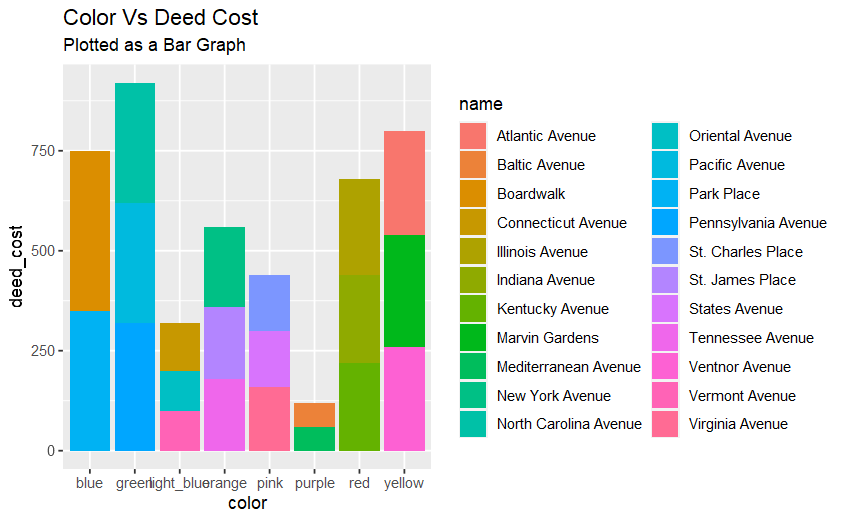
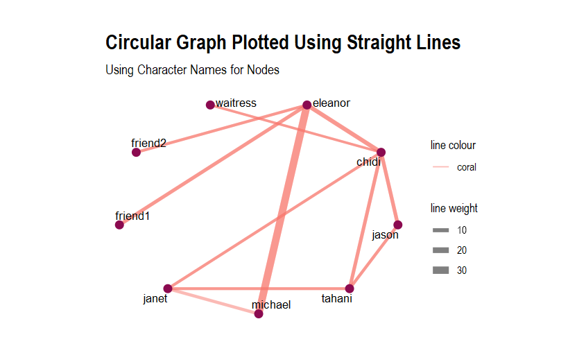
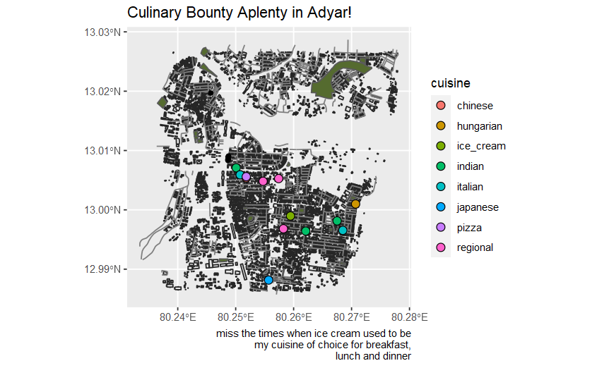

```{r setup, include=FALSE}
knitr::opts_chunk$set(echo = TRUE)
library(tidyverse)
library(tidygraph)
library(visNetwork)
library(igraph)
library(tidygraph)
library(ggraph)
library(graphlayouts)
library(igraphdata)
library(rnaturalearth)
library(rnaturalearthdata)
library(tmap)
library(osmplotr)
library(leaflet)
library(threejs)
library(sf)
```


I'm Al Karthikeyan, and as make your way down this page, you can see all the checkpoints I crossed as I journeyed my way down the path of most **R**esistance. You'll possibly also find my blood, sweat and several hundred bottles of tears.

<!--more-->


## GRAPH 1: THE QUEEN'S FAVOURITE

This graph is on the monopoly dataset, which, as the name suggests, has data on the popular board game Monopoly. The data here is for the American version of the game. The dataset has 11 columns, out of which six are varying versions of the kinds of rent paid in the game. The name, colour and tile of the property are qualitative elements while the rest are quantitative.


```{r read-1}
monopoly <- read.csv(file = "monopoly.csv")
monopoly
```

This is a qualitative vs quantitative bar graph and shows the relationship between the colour of the property with the deed cost, aka the cost of the property. The property colour is plotted on the X axis while the deed cost is on the Y axis. The bars are coloured by the name of the property.


```{r plot-1, eval=FALSE}
ggplot(monopoly, aes(x = color, y = deed_cost)) + geom_col(aes(fill=name)) + ggtitle(label = "Color Vs Deed Cost", subtitle = "Plotted as a Bar Graph")

```



I picked this graph as it struck the right balance between presenting information clearly while also being aesthetically pleasing. Plus, the sheer number of individual properties gives the graph a colourful look, which is always a good thing.

## GRAPH 2: ALICE'S FAVOURITE

For this group project, me and my teammates watched Season 1, Episode 6 of the show [The Good Place](https://www.imdb.com/title/tt4955642/mediaindex), called "What We Owe To Each Other", and noted down each interaction. Within the interactions, we marked how many times person A spoke, then person B. It got much harder [and more interesting!] when more than two characters were involved in the scene [like any scenes where the Jason/Tahani/Chidi/Janet spa interactions were happening]. It was also interesting to note the frequency of the interactions of the main six characters not only within themselves, but with other characters, recurring or not. 

```{r read-2}
tgp_nodes <- read.csv("tgp_nodes.csv")
tgp_edges <- read.csv("tgp_edges.csv")
tgp_nodes
tgp_edges
tgp <- tbl_graph(nodes = tgp_nodes, 
                 edges = tgp_edges,
                 directed = FALSE)
tgp

```

This network graph is a linear graph where the nodes are arranged in a circular manner. The edges are plotted as straight lines. The data is plotted so that it represents the interactions [aka the edges] between the characters [aka the nodes], and the width of the edges shows the frequency of the interactions. 


```{r plot-2, eval=FALSE}
ggraph(tgp, layout = "linear", circular = TRUE) + 
  geom_edge_link(aes(width = interactions, color = "coral"), alpha = 0.5) + 
  scale_edge_width(range = c(1, 3)) +
  geom_node_point(size = 3,colour = "deeppink4") + 
  geom_node_text(aes(label = name), repel = TRUE, size = 3.5, max.overlaps = 20) +
  labs(edge_width = "line weight", edge_color = "line colour") +
  theme_graph() +
  theme(legend.position = "right", aspect.ratio = 0.75) +
  labs(title = "Circular Graph Plotted Using Straight Lines",
       subtitle = "Using Character Names for Nodes")
```




This graph looks very organised, and also makes it very clear that Eleanor and Michael have the most one-on-one interactions in this episode.


## GRAPH 3: THE HATTER'S FAVOURITE

The data being plotted here is the list of restaurants in Adyar, Chennai, which is the city I grew up in. The dataset is quite lengthy and has many subsections that were of interest, but we worked on plotting the map based on the cuisine offered by each restaurant.

```{r read-3,eval=FALSE}
bbox <- osmdata::getbb("Adyar, Chennai, India")
bbox

buildings <- st_read("./buildings.gpkg")
parks <- st_read("./parks.gpkg")
greenery <- st_read("./greenery.gpkg")
trees <- st_read("./trees.gpkg")
roads <- st_read("./roads.gpkg")
restaurants <- st_read("./restaurants.gpkg")

osmplotr::osm_structures()

restaurants$cuisine %>% unique()

restaurants <- restaurants %>% 
  drop_na(cuisine) %>%
  separate(col = cuisine, into = c("cuisine", NA, NA), sep = ";") %>% 
  separate(col = cuisine, into = c("cuisine", NA, NA), sep = ",")

restaurants$cuisine

```

```{r plot-3, eval=FALSE}
ggplot() +
  geom_sf(data = buildings, colour = "gray15") +
  geom_sf(data = roads, colour = "gray50") +
  geom_sf(data = parks, fill = "darkolivegreen") +
  geom_sf(data = trees, fill = "darkolivegreen") +
  geom_sf(data = restaurants %>% drop_na(cuisine), aes(fill = cuisine), colour = "black", shape = 21, size = 3) +
  theme(legend.position = "right") +
  labs(title = "Culinary Bounty Aplenty in Adyar!",
       caption = "miss the times when ice cream used to be\nmy cuisine of choice for breakfast,\n lunch and dinner")

```




The map here shows the buildings, roads, trees and greenery present in Adyar, on top of which you can see coloured points that represent the cuisines of the restaurants present there. There are eight types of cuisines available in this area, and you can see these scattered across the map.

I quite like this graph, but mostly because it invokes a vague sense of nostalgia [even if I'm terrible at geography and wouldn't be able to guess which place is which on the map].


## THROUGH THE LOOKING GLASS

When I first entered the classroom and was immediately told that this course revolved more around engineering rather than design, I knew instantly that I was going to have to buckle in for an insane ride. Some interesting skills I picked up in these two weeks are:

* coding in R! That much should be a given.
* being on time! I found myself getting ready earlier and earlier as the days progressed, and quite enjoyed being some vague imitation of a "morning person".
* bleeding for data! Who would have thought that collecting and recording information would drain your life out? 
* lugging my incredibly heavy laptop back and forth daily! I never bought my laptop to college unless specified beforehand, so this workshop was a nice little workout for my back.
* drinking an absurd amount of energy drinks! In Arvind's words, I truly have become fond of that red liquid.
* losing whatever semblance of a sleep schedule I was maintaining until now! I am typing this at 12:48 AM. Enough said.

While the class was honestly one massive crunch of work [spruced up with my 2010s Kollywood songs playlist], I'm also incredibly proud of the things I've made. Coding is something that's deeply out of my comfort zone, but learning to do it regardless was a super cool feeling. Plus, the euphoria you get when the code finally gives in and ***works*** after 37 edits is truly unmatched [by all but a good night's rest, but I'm a college student stereotype and therefore don't know what that means]. 

I feel grateful to have been a part of Arvind's class for my workshop, for I got to listen to his Dad Jokes that are of varying degrees of quality + stare at my screen all day and not get told off about screentime by the supervising adult. I'm excited to find new ways to flex my shiny new R skills in future work!!!


