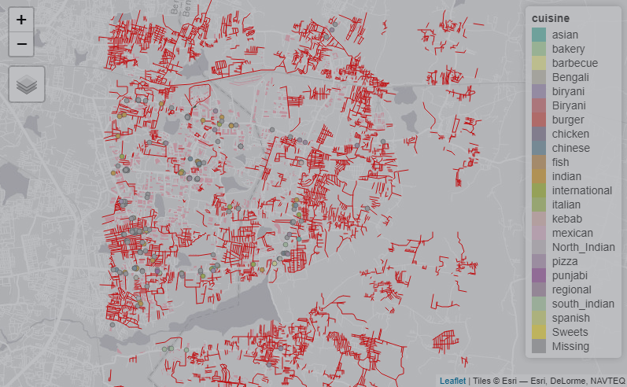
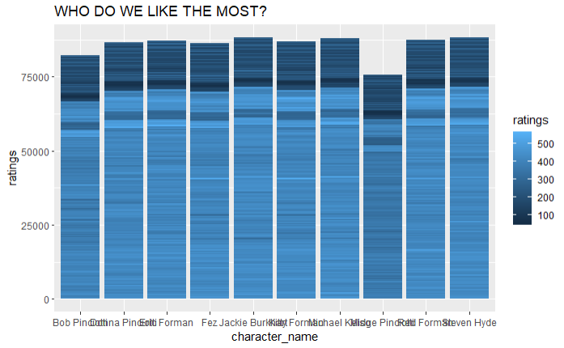
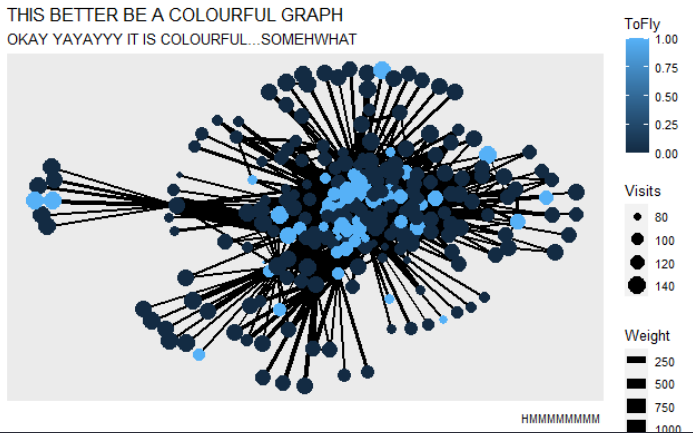

```{r setup, include=FALSE}
knitr::opts_chunk$set(echo = TRUE)
# Invoke all your packages here()
# library(blah blah)

```


Hiiiiiiiii!!!! I am Arya Kumar Chandrasekaran and I live in Yelahanka. My major is DMA!!! 

<!--more-->

## Introduction
During the course of this workshop I learnt how to code in *R* - we mostly worked on analysation and representation of different types of data and the creative coding that goes behind that. We made graphs, networks and maps, we also *CRIED* a lot(I know I did) :)  


## Graph 1

This is an interactive map I have made. It shows the restaurants by Cuisine in Whitefield, Bangalore. The different types of cuisines available in the area are listed and colored and accordingly the map has the points of the location of the restaurants and the points are in the color of the cuisine it offers or is famous for.

```{r read-1, eval=FALSE}
my_data_1 <- read_csv(".data/restaurants.csv")
glimpse(my_data_1)

```
To make this map we downloaded the data for the buildings, roads, parks and greenery(very less) in Whitfield to get a better and more detailed map. 

```{r plot-1, eval=FALSE}
tm_shape(dat_buildings) +
  tm_fill(col = "pink") +


tm_shape(dat_roads) +
  tm_lines(col = "red",labels = "destination") +

  
tm_shape(dat_greenery) +
  tm_polygons(col = "limegreen") +
  
  
tm_shape(restaurants) +
  tm_dots(col = "cuisine") + tm_legend(outside = TRUE)


```  



We used the function - tm_shape() to plot this. Overall I really liked this project, it was the perfect way to learn how to make maps - the project gave us the liberty to explore different functions and aesthetics, **AND HONESTLY WHATS BETTER THAN PLOTTING THE RESTAURANTS IN YOUR HOMETOWN WHILIST YOU ARE HUNGRY**

## Graph 2

**WHO DO WE LIKE THE MOST?**
This graph shows the rating given to the characters from the show. According to this data we can say that Jackie Burkhart, Micheal Kelso and Steven Hyde. Well I am not at all surprised since the majority of the story focuses on the Love Triangle between these three. I do strongly believe that Hyde and Jackie should have ended up together and In my eyes the final season of the show(s8) does not exist. These three characters had some of the best lines in the entire show and were all a comedic masterpiece on their own. 

```{r read-2, eval=FALSE}
my_data_2 <- read_csv(".Data/personalities.csv")
glimpse(my_data_2)

```


For this graph I have filtered out the data I want from an existing data set containing various TV Show Characters and the personality types. I have made mine on *THAT 70S SHOW* and here I have plotted in the form of a bar graph who the favorite/most liked characters are.

```{r plot-2, eval=FALSE}
personalities %>% filter(fictional_work %in% c("That 70's Show")) %>%  ggplot(.) + geom_col(aes(x = character_name , y = ratings, fill = ratings)) + ggtitle(label = "WHO DO WE LIKE THE MOST?")
```  




## Graph 3

This is from the Airlines data set. We learnt about nodes and edges and this was the first project where we used two data sets- edges and nodes and learnt how to merge them and to make networks and graphs.

```{r read-3, eval =FALSE}
my_data_3 <- read_csv(".Data/airlines.csv")
glimpse(my_data_3)
```

In this network I have plotted To Fly, Visits and Weight. 

```{r plot-3, eval=FALSE}
ggraph(graph = air, layout = "fr") +
  geom_edge_link0(aes(width = Weight), size = 3) +
  geom_node_point(aes( size = Visits, color = ToFly )) + 
  labs(title = "THIS BETTER BE A COLOURFUL GRAPH",
       subtitle = "OKAY YAYAYYY IT IS COLOURFUL...SOMEHWHAT",
       caption = "HMMMMMMMM ")

```  



## My Course Reflection

This course was about coding in *R*. R is a programming language for statistical computing and graphics. We learnt how to visualize and represent data in the form of graphs and networks. We understood the difference between good and accurate data and inaccurate data - which by the way make a a lot of difference in the output. We understood the working behind the making of maps and we also made a few - tedious but seriously interesting and maybe even **fun**.  


What I personally really understood which will always stay with me is that - aesthetics and quality of information are both very important aspects to keep in mind. If you quality of data is good but your way of presentation is bad then you may not be able to convey the information you wish to, similarly, a pretty graph may not necessarily be informative or useful. This is something that I kept having to tell myself during this course since many a time I would get carried away in the aesthetics of the graph, network or map and leave behind an absolute mess of a data , which would eventually render my output as not informative.  


*HOW WILL THIS HELP ME??* I kept asking myself this through these past 2 weeks, although I did enjoy and learn a lot I kept going back to how this will be of use to me. Well, *it's fun to be an artist who can code*. 

**Arvind is a horrible teacher and simply does not get what we need. Boomers should be allowed to teach any more in Srishti.**

<3<3

*Jai Hind.*
