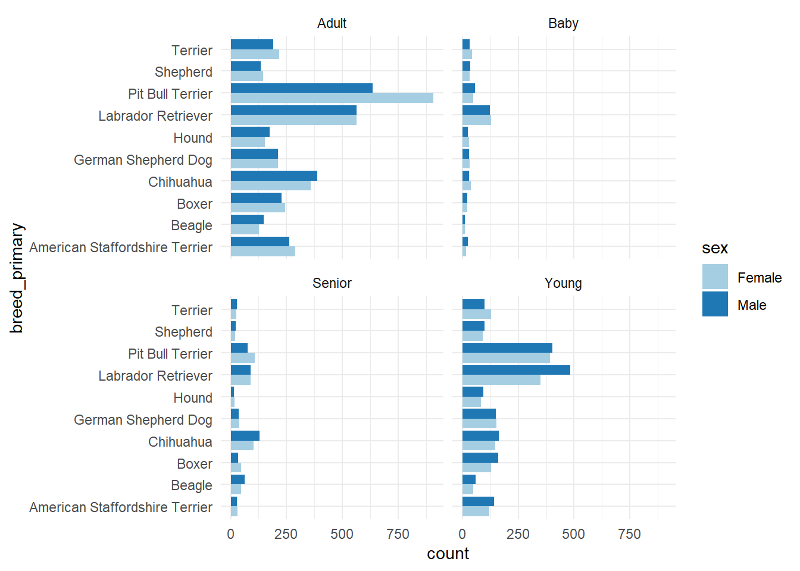
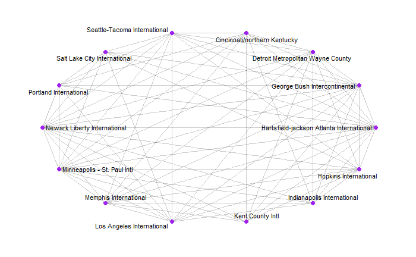
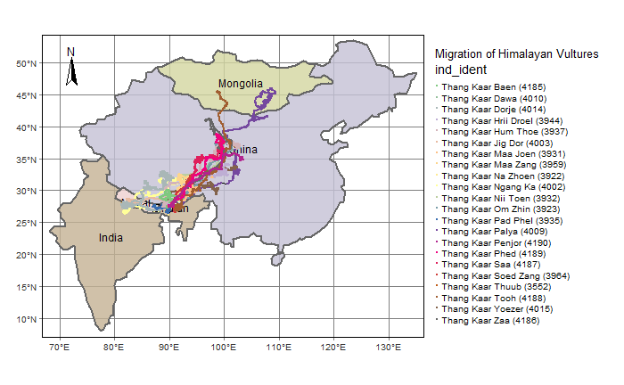

```{r setup, include=FALSE}
knitr::opts_chunk$set(echo = TRUE)
library(knitr)
library(tidyverse) # Maps using ggplot + geom_sf
library(tmap) # Thematic Maps, static and interactive
library(osmplotr) # "Bespoke" maps in R
library(sf) # For Spatial Data Frame Processing
```


I am Arya Mohan, a HCD student who loves to code and think quantitatively.  
<!--more-->

## Introduction

This is a small collection of my best works from this course.  
I am a cleanliness freak, so one thing you might notice about this page and its graphs is that it is ordered neatly. (is that something to flex though? XD)

## Graph 1

The `dog_data` was a csv data set that I downloaded from a research website online called **'Our World in Data'.** The data set had so many columns but I filtered out only the ones that were relevant to the graph that I wanted to plot.    
Some attributes that I found interesting were the `env_cats`, `env_children` and `env_dogs` columns, which was a *Boolean* type attribute which tell us whether a dog was **friendly** with cats, children or dogs. Unfortunately I had to discard them as they were irrelevant in my graph. XD  

```{r read-manipulate-1, echo = TRUE, message=FALSE, warning=FALSE}
# Reading the csv file and selecting only the attributes that were relevant to my graph
dog_data <- read.csv(file = "data/allDogDescriptions.csv")

# The below was a more case specific filtration which I did based on the top most frequently occurring breeds in the data set, and only filtered out the house trained dogs.
new_dog_data <- dog_data %>% select(breed_primary, age, sex, house_trained) %>% 
  filter(breed_primary %in% 
           c("Pit Bull Terrier", "Labrador Retriever", "Chihuahua", 
             "Terrier", "Hound", "German Shepherd Dog", "Boxer", 
             "Shepherd", "American Staffordshire Terrier", "Beagle"), 
         house_trained == TRUE) %>% 
  arrange(breed_primary, age, sex) %>% 
  group_by(breed_primary, age, sex) %>% 
  summarise(count = n()) 
new_dog_data %>% head() %>% kable()
```  
**Important attributes within the data set :-**  

- **breed_primary:**	The primary (assumed) breed assigned by the shelter or rescue.
- **age:**	The assumed age class of an animal (Baby, Young, Adult, or Senior).
- **sex:**	The sex of an animal (Female, Male, or Unknown).
- **house_trained:**	Whether or not an animal is trained to not go to the bathroom in the house.
- **name:** The animal’s name (as given by the shelter/rescue).
- **count:**	Count of certain unique groups of breed, age and sex.

Here with the given data, I wanted to *graphically* find out the **ratio of house trained adoptable dogs** between male and female dogs.    
The chart I could think of using for this was a **grouped bar graph**, where I would display the ratio for the top 10 most recurring breeds within the given data set.  
Also, to be able to make this chart, the given data set must be manipulated to make the relevant rows and columns.

```{r plot-1, eval = FALSE, echo = TRUE}
ggplot(new_dog_data, aes(x = count,y = breed_primary, fill = sex)) +
  geom_col(position = 'dodge') +
  facet_wrap(~age) +
  theme_minimal() +
  scale_fill_brewer(palette = "Paired")

```





```{r,echo=FALSE,eval=FALSE}

```


This was the final plot that I could make from the data given to me.  
It was quite interesting to see the variations in the number of trained dogs for different breeds across different age groups.  

1. It seems like the **'Young' and 'Adult' dogs have been trained the most,** which makes sense because 'Baby' and 'Senior' dogs are either too young or too old to train.  
1. Another interesting observation is that across all age groups, **the Pit Bull Terrier or the Labrador Retriever** seem to be the two breeds that are the most *well trained house dogs.*  
1. Across the plots, **males** have the same if not **more** number of **trained dogs** except in a few cases such as, the **'Female Adult Pit Bull Terrier'** has a *clear majority* as compared to its counterpart male dogs.  

## Graph 2

The below data sets are csv files that contains a **node table** for the various **airports** all across *America*, and also an **edge table** that shows the **routes** taken by the various flights.  
```{r read-2-a, eval = TRUE, echo = TRUE, message=FALSE, warning=FALSE}
# Reading the airline nodes csv but using a different delimiter
air_nodes <- read_delim("data/AIRLINES-NODES.csv",delim = ";")
air_nodes %>% head() %>% kable()
```

**Node Table Headers:-**  

- **Id :** Serial Number associated with the given airport.
- **Label :** Name of the airport.
- **Code :** Code for the city in which the airport lies.
- **City :** The city in which the airport lies.
- **Latitude :** Latitudinal degree of the airport.
- **Longitude :** Longitudinal degree of the airport.
- **ToFly :** Binary column.
- **Visits :** Number of plane visits.  

```{r read-2-b, eval = TRUE, echo = TRUE, message=FALSE, warning=FALSE}
# Reading the airline edges csv but using a different delimiter
air_edges <- read_delim("data/AIRLINES-EDGES.csv",delim = ";")
air_edges %>% head() %>% kable()

```

**Edge Table Headers:-**  

- **Source :** Name of the departure airport.
- **Target :** Name of the arrival airport.
- **Type :** The nature of the airlines direction.
- **Weight :** The intensity of trips.  

```{r manipulate-2, eval = FALSE, echo = TRUE}
# Using the 'tidygraph' package, we can merge the given node and edge data sets and create a new single object called a 'network graph object'.  
air_graph_obj <- tbl_graph(nodes = air_nodes, 
                edges = air_edges, 
                directed = FALSE)

# Using the graph object I add the same 'centrality_degree' function to control the degree and filter the number of airports in the graph object.
air_centrality <- air_graph_obj %>% 
  activate(nodes) %>% 

  mutate(degree = centrality_degree(mode = c("in"))) %>% 
  
# According to my understanding of this function, only the nodes with a higher relative degree than given are passed through the function and saved into the network graph object
  filter(degree > 25) %>% 

  activate(edges) %>% 
  mutate(betweenness = centrality_edge_betweenness())

air_centrality %>% activate(nodes) %>% as_tibble() %>% kable()
```

**The network I wanted to plot aimed for the following:-**  

- To map the various airports and link the trips that take place between them.  
- To analyse the trends of airlines and identifying the topmost popular airports.  

```{r plot-2, eval = FALSE, echo = TRUE}
ggraph(air_centrality, layout = "linear", circular = TRUE) +
  geom_edge_link(alpha = 0.2) +
  geom_node_point(size = 2, colour = "purple") +
  geom_node_text(aes(label = Label),repel = TRUE, 
                 size = 3,
                 max.overlaps = 20) +
  theme_graph()

```




This graph represents the interconnections between the 14 **most frequently** visited airports in America.  
We can see how **almost all** the airports have some flight traveling between them.  

1. This implies that all the airports **do not necessarily** have to be interconnected to every other airport in order to be one of the most visited airports.
1. We can see how the **density of lines** around the various airports are almost comparable, which implies that they have a **very similar** amount of visits.

## Graph 3

**The data I extracted below are of 3 levels and serve different purposes :-**  

1. **vulture_points :** An shp data file that contains a **POINT** type data set of all the points that the **Himalayan Vultures visited** while migrating.
1. **vulture_lines :** Another shp data file that contains a **LINE** type data set of the **route taken by the Himalayan Vultures** in their migration.
1. **migration_countries :** A filtered version of the 'WORLD' data set in which there is **GEOMETRIC values** for the **countries over which** the Himalayan Vultures migrated.  

```{r read-manipulate-3, eval = FALSE, echo = TRUE}
data("World")
migration_countries <- World %>% filter(iso_a3 %in% c("IND", "CHN", "MNG", "NPL", "BTN"))

vulture_points <- st_read("data/Himalayan_Vultures/points.shp")
vulture_lines <- st_read("data/Himalayan_Vultures/lines.shp")
```

The graph I am going to plot involves a **visual representation of the migration path** taken by the Himalayan Vultures.  
The graph is supposed to show the different routes taken by the various identities of the **Himalayan Vulture.**  

```{r plot-3, eval = FALSE, echo = TRUE}
vulture_migration <- 
  tm_shape(migration_countries) +
    tm_graticules() +
    tm_polygons(alpha = 0.8, col = "name", lwd = 2, legend.show = FALSE) +
    tm_text("name", size = 3/4) +
    tm_compass(type = "arrow", position = c("left", "top")) +
  tm_shape(vulture_lines) +
    tm_lines() +
  tm_shape(vulture_points) +
    tm_dots(col = "ind_ident", palette = "Accent") +
  tm_layout(legend.outside = TRUE, 
            legend.outside.position = "right",
            title= 'Migration of Himalayan Vultures')
vulture_migration
```




## My Course Reflection

`Digital Making` was an unexpectedly fun workshop. I absolutely loved learning how to code in R. I took away a lot from this journey and the learning **did not come easy**. A few lessons I can recollect 'R' :-

- Coding **isn't** a skill that is language specific. I realized that the **workflow and ideas** are more important, and learning the language is secondary but still something that I must learn to do faster as it is **rapidly evolving and progressing.**
- Finding my state of flow while coding was something that I personally found tough, but once I was in it, it felt like there was **no limit** to achieving whatever I wished to, purely through code.
- There is a **lot of research** one must do to surely know how to code. This seemed like a pretty obvious lesson to learn but I could not comprehend *the gravity of it* until I experienced this workshop.
- The amount of work that goes into **polishing data** before plotting it is **majority** of the work when it comes to data visualization. Data is beautiful and fascinating to the human eye but this is **not** the same for a dumb machine like the computer. Although it can process stuff easily, it is not as intelligent as a human, so data **must be formatted** into forms that only the computer can interpret, which proves to be quite a monumental task.
- I was absolutely fascinated by the result of all the grunt work behind each and every plot. It was a very satisfactory experience and made me fall in love with coding even more and even with the language itself.

To come to the end of this workshop is a bittersweet feeling. Classes were ~~tiring~~ fun and interactive and perfectly paced to suit the majority's standards. I learnt a certain **work ethic** which was the most valuable lesson of them all, and something that I will consciously make an effort to maintain through my journey at Srishti.  
Bravo six, 'R'ya going dark <3
