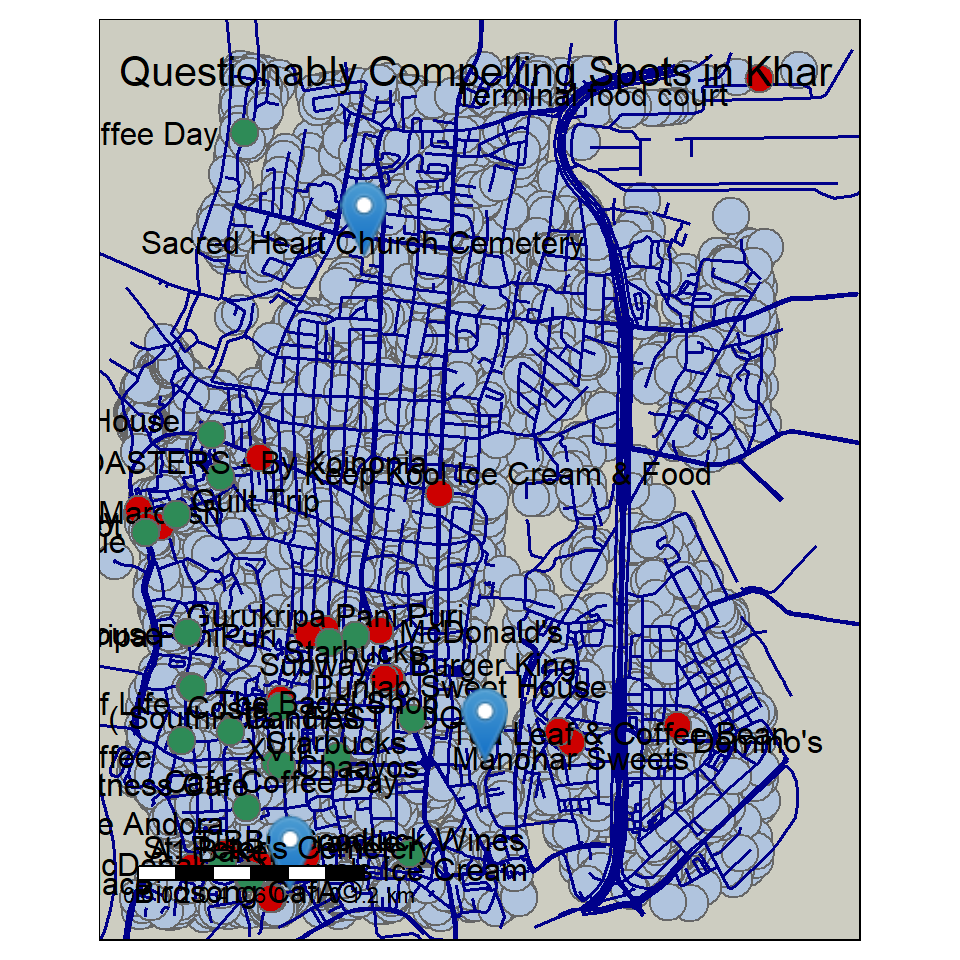
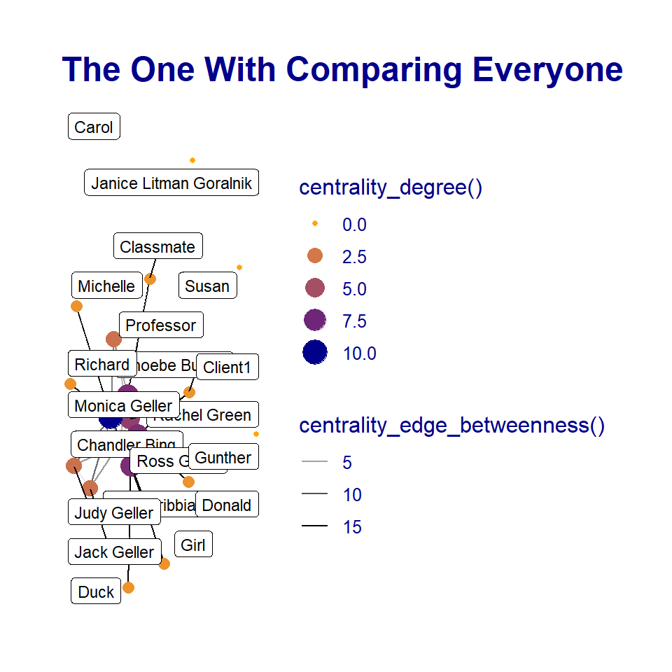
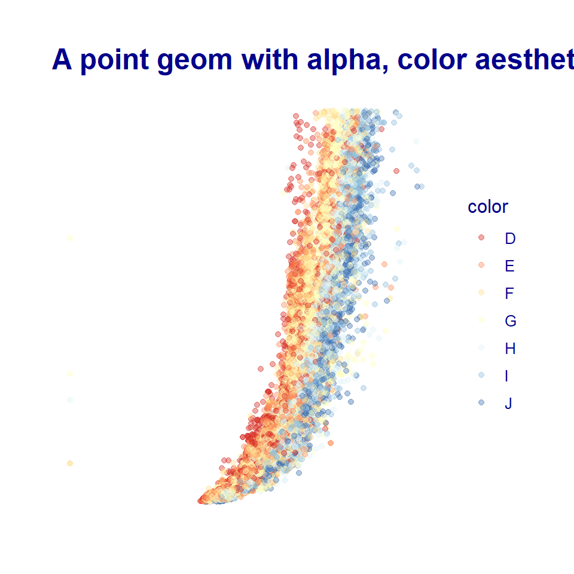

## Introduction

Hello, I am Devanshi, below are some graphs I did using Rstudio.\

## tMAPS

We learnt how to create a map with code using 'tmaps'.I created an interactive map of Khar, Mumbai and plotted buildings,roads, fast-food places, cafes and cemeteries.\

### Getting the coordinates


```r
bbox_khar <- getbb("Khar, Mumbai, India")

bbox_khar
```

```
##        min      max
## x 72.81371 72.85371
## y 19.05246 19.09246
```

### Extracting the Data


```r
dat_khar_B <- extract_osm_objects(bbox_khar, "building")

dat_khar_H <- extract_osm_objects(bbox_khar, "highway")


dat_khar_R <- extract_osm_objects(bbox_khar, key = "amenity", value =  "fast_food", return_type = "points")


dat_khar_E <- extract_osm_objects(bbox_khar, key = "amenity", value = "cafe", return_type = "points")


dat_khar_G <- extract_osm_objects (bbox = bbox_khar, key = "landuse", value = "cemetery")
```


```r
  tmap_mode("plot")

  tm_shape(dat_khar_B)+
  tm_bubbles(col = "lightsteelblue")+

  tm_shape(dat_khar_H) +
  tm_lines(col = "darkblue", lwd = 1.5) + #roads
  
  tm_shape(dat_khar_R) +
  tm_symbols(col = "red3") + 
  tm_text("name", auto.placement = TRUE, size = 1) +  #fast food
  
  tm_shape(dat_khar_E)+
  tm_symbols(col = "seagreen")+
  tm_text("name", auto.placement = TRUE, size = 1)+ #cafe
  
  tm_shape(dat_khar_G)+
  tm_markers( col = "blue")+  #cemetery
  tm_text("name", auto.placement = TRUE, size = 1)+ #cemetery
  
  # tm_compass(type = "rose", position = c("right", "top")) +
  
  tm_scale_bar(width = 4, position = c("left", "bottom"), text.size = 1) +
  
  tm_layout(title = "Questionably Compelling Spots in Khar", title.size = 4, fontfamily = "Century Gothic", bg.color = "ivory3")
```



```r
  tmap_style("watercolor")
```

-   light blue : buildings
-   dark blue : roads
-   red : fast-food places
-   sea green : cafes
-   markers : cemeteries

## The One With Plotting 'Friends' In **R**

I constructed my dataset based on the iconic TV show 'Friends'.\
I chose 3 random episodes across the seasons to map the number of interactions among the characters.\


```r
friends_nodes <-  read_csv("Friends-Nodesdatasettwo.csv" )
friends_edges <-  read_csv( "Friends-Edgesdatasettwo.csv")
friends_nodes
```

```
## # A tibble: 20 x 5
##    names                  sex   condition     sign           id
##    <chr>                  <chr> <chr>         <chr>       <dbl>
##  1 Rachel Green           F     employed      Libra           1
##  2 Monica Geller          F     employed      Virgo           2
##  3 Phoebe Buffay          F     self-emplyed  Aquarius        3
##  4 Joey Tribbiani         M     self-employed Leo             4
##  5 Chandler Bing          M     employed      Gemini          5
##  6 Ross Geller            M     employed      Taurus          6
##  7 Gunther                M     self-employed Scorpio         7
##  8 Jack Geller            M     unemployed    Virgo           8
##  9 Judy Geller            F     unemployed    Aquarius        9
## 10 Janice Litman Goralnik F     unemployed    Sagittarius    10
## 11 Carol                  F     unemployed    Cancer         11
## 12 Susan                  F     employed      Virgo          12
## 13 Professor              M     self-employed <NA>           13
## 14 Client1                M     <NA>          <NA>           14
## 15 Richard                M     self-employed Capricorn      15
## 16 Girl                   F     <NA>          <NA>           16
## 17 Donald                 M     <NA>          <NA>           17
## 18 Michelle               F     <NA>          <NA>           18
## 19 Classmate              F     <NA>          <NA>           19
## 20 Duck                   M     <NA>          <NA>           20
```

```r
friends_edges
```

```
## # A tibble: 30 x 4
##    from           to             weight type    
##    <chr>          <chr>           <dbl> <chr>   
##  1 Joey Tribbiani Chandler Bing      10 friends 
##  2 Ross Geller    Joey Tribbiani     13 friends 
##  3 Ross Geller    Chandler Bing      11 friends 
##  4 Rachel Green   Ross Geller        10 benefits
##  5 Ross Geller    Phoebe Buffay       8 friends 
##  6 Chandler Bing  Phoebe Buffay       7 friends 
##  7 Monica Geller  Phoebe Buffay       8 friends 
##  8 Monica Geller  Ross Geller         7 siblings
##  9 Phoebe Buffay  Rachel Green        9 friends 
## 10 Monica Geller  Rachel Green        5 friends 
## # ... with 20 more rows
```


### Creating a 'tbl_graph'

A 'tbl_graph' is needed to provide the attributes and brief description of the dataset./


```r
friends <- tbl_graph(nodes = friends_nodes, 
                edges = friends_edges, 
                directed = FALSE)
friends
```

```
## # A tbl_graph: 20 nodes and 30 edges
## #
## # An undirected simple graph with 5 components
## #
## # Node Data: 20 x 5 (active)
##   names          sex   condition     sign        id
##   <chr>          <chr> <chr>         <chr>    <dbl>
## 1 Rachel Green   F     employed      Libra        1
## 2 Monica Geller  F     employed      Virgo        2
## 3 Phoebe Buffay  F     self-emplyed  Aquarius     3
## 4 Joey Tribbiani M     self-employed Leo          4
## 5 Chandler Bing  M     employed      Gemini       5
## 6 Ross Geller    M     employed      Taurus       6
## # ... with 14 more rows
## #
## # Edge Data: 30 x 4
##    from    to weight type   
##   <int> <int>  <dbl> <chr>  
## 1     4     5     10 friends
## 2     4     6     13 friends
## 3     5     6     11 friends
## # ... with 27 more rows
```

## Centrality Graph


```r
set_graph_style( family = "Calibri", face = "plain", size = 12, text_size = 13, text_colour = "darkblue")

friends %>% 
  activate(nodes) %>% 
  
  # Who has the most connections?
  mutate(degree = centrality_degree()) %>% 
  
  activate(edges) %>% 
  # Who is the go-through person?
  mutate(betweenness = centrality_edge_betweenness()) %>%
  
  
  # discrete colour legend
  scale_color_gradient(guide = "legend")
```

```
## <ScaleContinuous>
##  Range:  
##  Limits:    0 --    1
```

```r
# or even less typing
  ggraph(friends,layout = "nicely") +
  geom_edge_link(aes(alpha = centrality_edge_betweenness())) +
  geom_node_point(aes(colour = centrality_degree(), 
                      size = centrality_degree())) + 
  scale_color_gradient(guide = "legend",
                       low = "orange",
                       high = "darkblue")+
  geom_node_label(aes(label = names),repel = TRUE, max.overlaps = 30, size = 3)+
  labs(title = "The One With Comparing Everyone ")
```



The graph filters the interaction between the characters. The character having the highest 'centrality degree' and 'centrality edge' is responsible for being the one that links many characters together.

## *Diamonds* Graph

I chose the 'diamonds', dataset to analyze the relationships among its various features.


```r
glimpse(diamonds)
```

```
## Rows: 53,940
## Columns: 10
## $ carat   <dbl> 0.23, 0.21, 0.23, 0.29, 0.31, 0.24, 0.24, 0.26, 0.22, 0.23, 0.~
## $ cut     <ord> Ideal, Premium, Good, Premium, Good, Very Good, Very Good, Ver~
## $ color   <ord> E, E, E, I, J, J, I, H, E, H, J, J, F, J, E, E, I, J, J, J, I,~
## $ clarity <ord> SI2, SI1, VS1, VS2, SI2, VVS2, VVS1, SI1, VS2, VS1, SI1, VS1, ~
## $ depth   <dbl> 61.5, 59.8, 56.9, 62.4, 63.3, 62.8, 62.3, 61.9, 65.1, 59.4, 64~
## $ table   <dbl> 55, 61, 65, 58, 58, 57, 57, 55, 61, 61, 55, 56, 61, 54, 62, 58~
## $ price   <int> 326, 326, 327, 334, 335, 336, 336, 337, 337, 338, 339, 340, 34~
## $ x       <dbl> 3.95, 3.89, 4.05, 4.20, 4.34, 3.94, 3.95, 4.07, 3.87, 4.00, 4.~
## $ y       <dbl> 3.98, 3.84, 4.07, 4.23, 4.35, 3.96, 3.98, 4.11, 3.78, 4.05, 4.~
## $ z       <dbl> 2.43, 2.31, 2.31, 2.63, 2.75, 2.48, 2.47, 2.53, 2.49, 2.39, 2.~
```


```r
diamonds <- diamonds %>% drop_na()
```


```r
diamonds %>% 
  slice_sample(prop = 0.7) %>% 
  ggplot(.) +
  geom_point(aes(x = x, y = price, color = color), alpha = 0.4) + scale_color_brewer(palette = "RdYlBu") +
ggtitle("A point geom with alpha, color aesthetics")
```



```r
#alpha + color
```

We can see the co-relation between 'x', the length in mm and 'price'. When the length is increased, the price too rises, the readings are filtered by another qualitative feature, 'color' which ranks the diamond color from D(best) to J(Worst).

## Reflection

This course reformed my outlook on coding, Arvind's belief that intuition is more important than just memorizing the code, not only made coding less stressful but also fun to play around with. We were introduced to the idea that geometrical shapes can hold complex metaphors. I learnt some methods of unfolding all the components of a dataset and to try and observe the layers closely to know its significance. I learnt a lot about paying attention to the minutest detail, to explore freely and to learn by trial-and-error method. I feel that I can take foreword these concepts to further explore networks and numbers.


