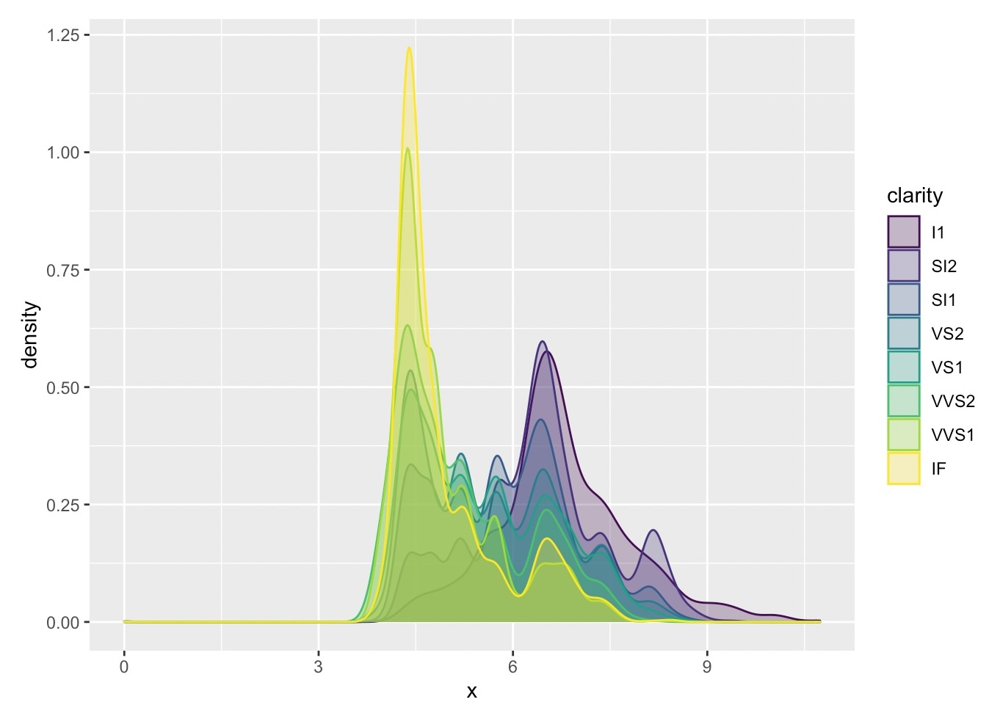

```{r setup, include=FALSE}
knitr::opts_chunk$set(echo = TRUE)
library(rnaturalearth)
library(rnaturalearthdata)
library(tidyverse) 
library(tmap) 
library(osmplotr) 
library(leaflet) 
library(threejs) 
library(sf)
library(ggplot2)
```


Hello! I'm Janavi Moncourt. I'm in my first year of design at Srishti Manipal Institute located in Bangalore. 
<!--more-->

## Introduction

For the two weeks of our workshop cycle, we've been studying and working with Rstudio. Rstudio is an open-source software for data science, scientific research, and technical communication. Through the last two weeks, we've worked with multiple datasets ranging from diamonds, to airlines, and even TV shows such as Modern Family, The Office, and so on. We focused on analyzing, and collecting data that we used to create visualizations representing networks, and relationships between multiple variables.** 

### **Graph 1**
The dataset we will be studying through this graphs is described as ‘fossil CO2 emissions’. It includes all emissions from energy production (coal, oil, gas and flaring) plus direct industrial emissions from cement and steel production, 1959 onward. The countries that have been recorded include India, China, The United Kingdom, The United states, and the world.

```{r,eval=FALSE}
co2<-read_csv(data("co2.csv"))
glimpse(co2)
```

```{r,eval=FALSE}
co2 %>% filter(Entity %in% c("India","China","United Kingdom","United States","World"))
```

```{r, eval=FALSE}
ggplot(co2, aes(x =Year, 
                color=Entity, 
                y=`Annual CO2 emissions (per capita)`))+
  geom_line() + geom_point() + theme(legend.position = "none")
```


### **Analysis** 

From this graph, we see that the United states recorded the highest CO2 emissions from fossil fuels and their industries through the years of 1950 - 1980. 

### **Graph 2** 

In this dataset, we will be exploring different types of diamonds and how their elements are co-related. The Diamonds dataset contains the prices and other attributes of almost 54,000 diamonds. From the following graph, the point is to interpret the correlation between two variables of a diamond, clarity and length(x). The aim is to observe patterns within the subsequent increase and decrease in the clarity and length(x) of a diamond.


```{r,eval=FALSE}
ggplot(diamonds) + geom_density(aes(x = x ,color = clarity, fill = clarity), 
alpha = 0.3)
```



### **Analysis** 

From this graph we understand that the clarity of a diamond is best within the length range of 3mm - 8mm. As the length of the diamond keeps increasing, there is a subsequent decrease in the clarity of the diamond. Hence, the ideal length of a clear diamond lies between 3mm-8mm with ideal clarity. 

### **Graph3**

The following dataset we are going to look at consists of restaurants spread across Richmond Town, in central Bangalore. 

```{r,eval=FALSE}
ggplot() +
  geom_sf(data = buildings, colour = "burlywood1") +
  geom_sf(data = roads, colour = "gray80") +
  geom_sf(
    data = restaurants %>% drop_na(cuisine),
    aes(fill = cuisine),
    colour = "White",
    shape = 21,
    size = 3
  ) +
  theme(legend.position = "right") +
  labs(title = "Restaurants in Richmond Town, Bangalore",
       caption = "Based on osmdata")
```


### **Analysis** 
This Graph represents various restaurants spread across Richmond Town in central Bangalore. The restaurants have been categorized based on their cuisine and color codded accordingly to provide a clearer visualization and understanding.

### **Reflection**

These last two weeks have been treacherous, to say the least. As someone who has 0 experience coding, let alone a basic understanding of how computers work, this has been the most challenging course for me. On a more pleasant note, I truly enjoyed this challenge. I walked into class the very first day hesitant and lost, as opposed to a lot of kids who picked up coding on the first day. But I told myself, things take time, and you will learn with time.

What was interesting to see was the transformation of a codes into a whole graphic visualization. The ability of a computer to pick up on the smaller elements of life such as trees, buildings, roads, and so on, and knit you a map of your childhood home is amusing. As dramatic as it may sound, It felt like I was watching my past come to life through a screen.

A concept that  I’ve come to realize, is the importance of embedding your art with a human essence, whether this essence triggers your senses, taste, smell, touch, or triggers a happy memory. Just like plotting my hometown in Rstudio with the use of different geometric aesthetics triggered a very happy childhood memory for me, I would want my art to do the same. Whether it’s amusement, sympathy, sorrow, or euphoria, the ability to invoke human emotions and knit experiences for all of us lies with us, and that’s a code I’d like to run for the rest of my life as an aspiring artist. It was also fascinating to see the outputs produced through correlated variables we unconsciously tend to use daily, whether pronouns or numbers.

Studying and working with R studio over the course of the last two weeks has taught me various skills.R studio has helped me develop a clearer intuition within basic programming through the use of multiple tools. I have developed the ability to view the world, the way a simple code does, although not as fast or accurate. Like I’ve said before, this language has taught me to pick up and store pieces of information that could hold some value in the future, reserve them, and run the program in the future. Studying this language somehow felt like studying real life. As much as I struggled, this course challenged my capabilities, and I truly enjoyed it.
