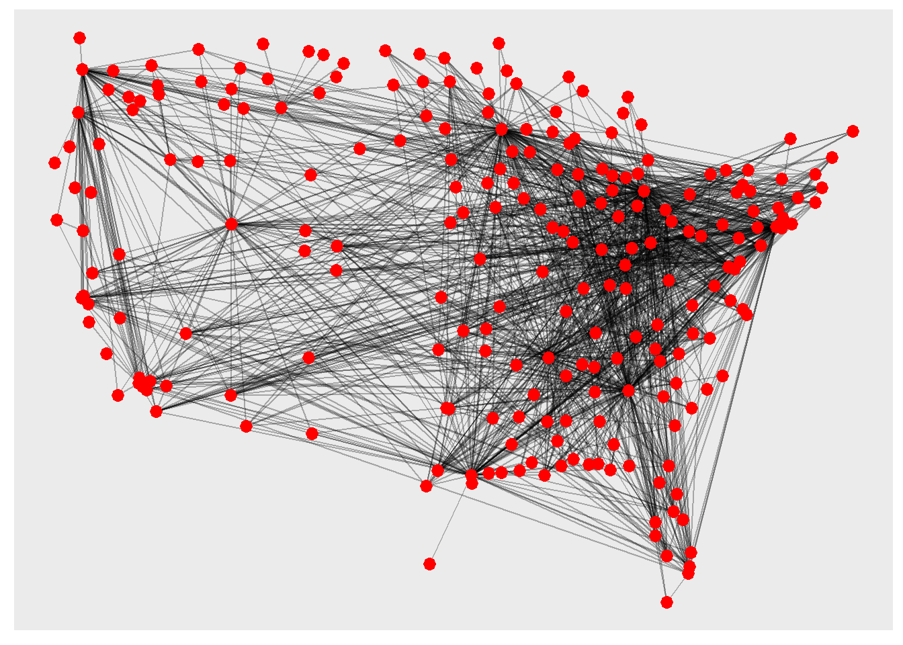
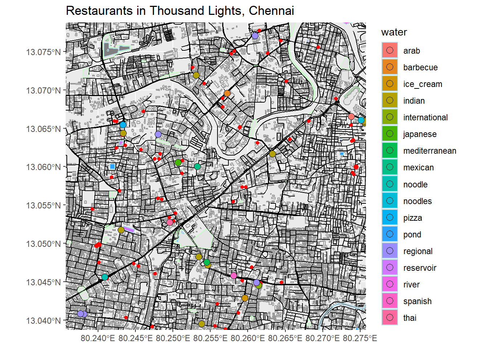

Hi! I am Nithin Suresh from Chennai. I am going to show the different "visualizations" that I made throughout this course

<!--more-->

```{r setup, include=FALSE}
knitr::opts_chunk$set(echo = TRUE, message = FALSE)

library(rnaturalearth)
library(rnaturalearthdata)
library(rnaturalearthhires)
library(tidyverse)
library(tmap)
library(osmplotr)
library(leaflet) 
library(threejs)
library(sf)
library(visNetwork)
library(igraph)
library(tidygraph)
library(ggraph)
library(graphlayouts)
library(igraphdata)
library(downloadthis)
library(knitr)

```

## Introduction

Hello, I'm Nithin Suresh and I'm from Chennai. My major is IADP. I took a break year to figure out what I wanted to do and here I am. I've had a very brief attempt at coding before but I never worked on it as I found the task pretty daunting. This was my first proper go at it and it has gone pretty well so far. In this page, I'll be presenting one graph from each of my assignments and I'll be explaining/decoding them along the way. 


## Graph 1

For the first graph, I'll be presenting a graph I made for A1 using a dataset of Pokémons. For this graph, I'll be finding out which type of Pokémon is the strongest. 

```{r read-1, echo = TRUE, eval=FALSE}
pokemon <- read_csv(file = "data/pokemon.csv")

pokemon %>% kable()

glimpse(pokemon)

```

I'll be using a **boxplot** to find out the answer. 


```{r plot-1, echo = TRUE, eval=FALSE}
ggplot(pokemon) +
  aes(x = `type/0`, y = total, color=`type/0`) +
  geom_boxplot() +
  scale_fill_viridis_d (option = "magma") +
  theme(axis.text = element_text(angle = 45, size = 7))

```

Looking at the boxplots, we can say **Dragon** is the strongest type of Pokémon. Even though it might not have the strongest Pokémon (which is Mewtwo), the average **total** of all the Pokémons which come under that type is higher. For differentiating each type, I've used the 'aes' to fill the color according to the number of types and applied the 'magma' color palette.

## Graph 2

For the second graph, I've used the dataset of airports in the US just like many others. This dataset contains a list of all the airports in the United States along with their code, city and co-ordinates. As the previous graphs I made using this data looked messy and did not really convey anything to the viewer, I decided to plot all the airports in the dataset according to their co-ordinates. This made the whole data to be more presentable. First, I had to combine the nodes and edges csv files into one file to be able to use it in graphs.

```{r read-2, echo = TRUE, eval=FALSE}
planes_nodes <- read_delim("data/AIRLINES-NODES.csv",delim = ";")
planes_edges <- read_delim("data/AIRLINES-EDGES.csv", delim = ";")

planes_graph <- tbl_graph (nodes = planes_nodes, edges = planes_edges, directed = FALSE)
planes_graph

glimpse(planes_nodes)
glimpse(planes_edges)

```

Before I plotted the points, I first had to select the longitude and latitude columns from the nodes file, then had to transmute the data by **1000000** to get the values to the right decimal point. After that was done, I could plot the points and the result was in the shape of the US. 



```{r plot-2, echo = TRUE, eval=FALSE}
planes_nodes %>% select(latitude, longitude)

airline2 <- planes_nodes %>% select(latitude, longitude) %>% transmute(Latitude = latitude / 1000000, Longitude = longitude / 1000000)
           
airline2

my_layout <- cbind(x = airline2$Longitude, y = airline2$Latitude) %>% as.matrix()
g <- tbl_graph(nodes = planes_nodes, edges = planes_edges)
ggraph(g, layout = my_layout) + geom_edge_link0(alpha = 0.3) + geom_node_point(shape = 21, size = 1, fill = "red", color = "red", stroke = 2) + theme(legend.position = "none")

```

## Graph 3

For the final graph, I'm presenting a map of an area from my hometown, Chennai, with restaurants plotted across it. 

```{r read-3, echo = TRUE, eval=FALSE}
bbox_1 <- osmdata::getbb("Thousand Lights, Chennai, India")
bbox_1

```

I had to extract the data of multiple objects such as buildings, roads, parks, water bodies amongst using OSM (Open street Map). The next step was to make the data readable. To make the map more captivating and vibrant, I decided to show the different types of cuisines which are available. This is plotted with each of the cuisine type having its own colour. Finally, I used **geom_sf** to execute and create the final map. 



```{r plot-3, echo = TRUE, eval=FALSE}

dat_buildings <-extract_osm_objects (key = "building", 
                                     bbox = bbox_1)

dat_roads <- extract_osm_objects (key = 'highway', 
                                  bbox = bbox_1)

dat_parks <- extract_osm_objects (key = 'park', 
                                  bbox = bbox_1)

dat_greenery <- extract_osm_objects (key = 'landuse', 
                                  value = 'grass', 
                                  bbox = bbox_1)

dat_amenities <- extract_osm_objects (key = 'amenity', 
                                  value ="restaurant", 
                                  return_type = "point",
                                  bbox = bbox_1)

dat_water <- extract_osm_objects (key = 'water', 
                                  value ="waterway",
                                  return_type = "polygon",
                                  bbox = bbox_1)

dat_river <- extract_osm_objects (key = 'water', 
                                  value ="river",
                                  return_type = "polygon",
                                  bbox = bbox_1)

st_write(dat_buildings, dsn = "buildings.gpkg", append = FALSE, quiet = FALSE)
st_write(dat_parks, dsn = "parks.gpkg", append = FALSE, quiet = FALSE)
st_write(dat_greenery, dsn = "greenery.gpkg", append = FALSE,quiet = FALSE)
st_write(dat_roads, dsn = "roads.gpkg", append = FALSE, quiet = FALSE)
st_write(dat_amenities, dsn = "amenities.gpkg", append = FALSE, quiet = FALSE)
st_write(dat_water, dsn = "water.gpkg", append = FALSE, quiet = FALSE)
st_write(dat_river, dsn = "river.gpkg", append = FALSE, quiet = FALSE)

buildings <- st_read("./buildings.gpkg")
parks <- st_read("./parks.gpkg")
greenery <- st_read("./greenery.gpkg")
roads <- st_read("./roads.gpkg")
amenities <- st_read("./amenities.gpkg")
water <- st_read("./water.gpkg")
river <- st_read("./river.gpkg")

restaurants <- amenities %>% drop_na(cuisine) %>% 
  separate(col = cuisine, into = c("cuisine", NA, NA), sep = ",") %>% 
  separate(col = cuisine, into = c("cuisine", NA, NA), sep = ";")
restaurants$cuisine

nrow(buildings)
buildings$geom
class(buildings$geom)

roads <- roads %>% filter(!osm_id == 69610248)

ggplot() +
  geom_sf(data = buildings, colour = "grey60") +    
  geom_sf(data = roads, col = "black") +           
  geom_sf(data = parks, col = "darkseagreen1") +    
  geom_sf(data = greenery, col = "darkseagreen") +
  geom_sf(data = amenities, col = "red") +
  geom_sf(data = water, 
          aes(fill = water),
    colour = "lightblue") +
  geom_sf(data = restaurants %>% drop_na(cuisine),
    aes(fill = cuisine),
    shape = 21,
    size = 3) +
  theme(legend.position = "right") +
  labs(title = "Restaurants in Thousand Lights, Chennai") +
  coord_sf(xlim = c(80.23571, 80.27571), ylim = c(13.03878, 13.07878), expand = FALSE)

```

## My Course Reflection

This being my first genuine attempt at coding, it had went better than I expected it to. I still find it pretty overwhelming but learning it manually and in person definitely helped as it grasped my interest. The satisfaction of the code ending up working and getting to see the final product was worthy. 

I have learnt a handful of things during the workshop. I learnt how much work goes into just creating one simple graph that we would see on a newspaper or even creating a simple webpage. I also learnt the sheer amount of possible things you could make with code. Having one of the seniors who Arvind had taught talk about how coding had helped him was really insightful. Aman talked us through his internship at Reuters explaining the work he had done and how he done it. He also gave us some great tools which would help us with in the future. This talk opened my mind about how I would implement coding into my work in the future. 

The 2 weeks of workshop had many ups and downs as there were surely moments where I was completely exhausted from coding and I just wanted to do some artwork. As much as I am excited to be hopefully doing art again, I will surely miss the small coding environment we had. I will miss working with my fellow "coders", overcoming obstacles together and helping each other out.

Going in, I was excited to be in Arvind's class as I used to talk to him about the music he plays in class almost every morning. My college-mates and seniors also mentioned how much of a great teacher/mentor he is. My experience with him was as fun and insightful as I thought it would be and I would not change a thing. I would say I am privileged to be part of the last batch of students Arvind would teach in Srishti. 

