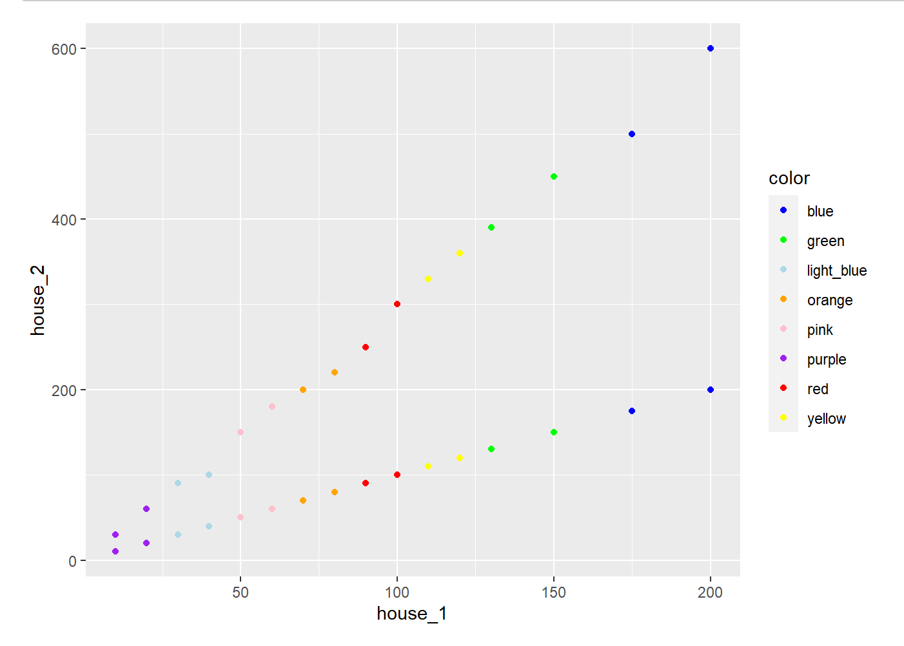
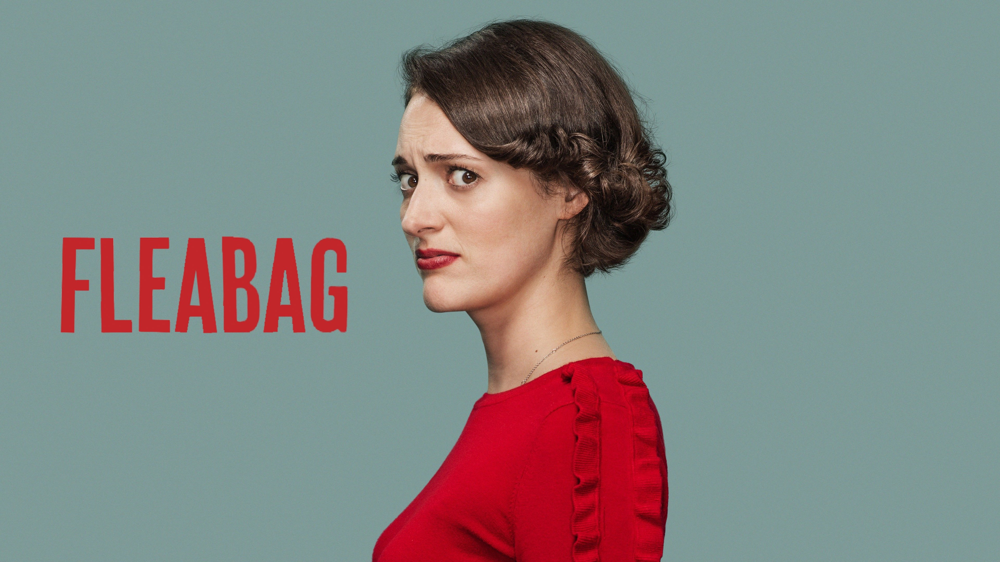
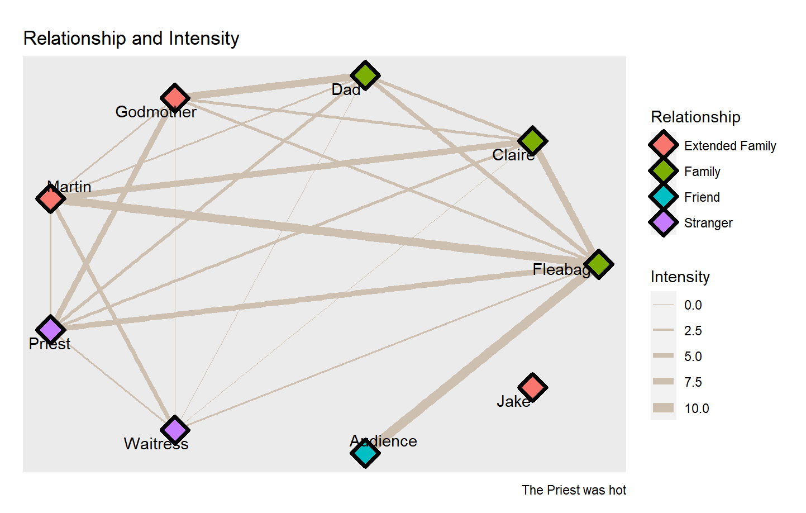
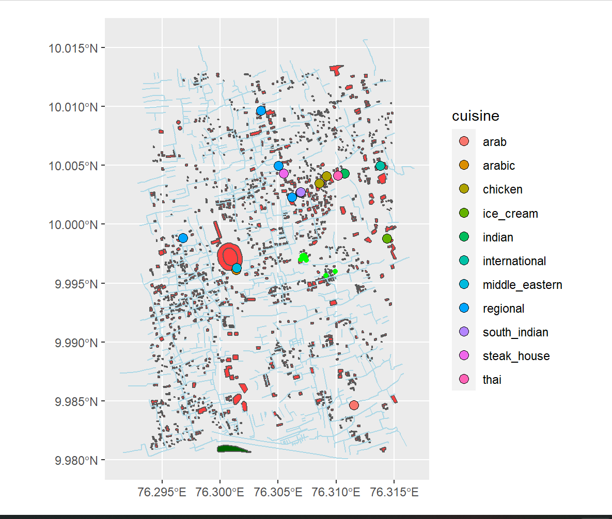

```{r setup, include=FALSE}
knitr::opts_chunk$set(echo = TRUE)
library(ggplot2)
library(tidyverse)
library(tidygraph)
library(ggraph)
library(igraph)
library(igraphdata)
library(graphlayouts)
library(osmplotr)
library(rnaturalearth)
library(rnaturalearthdata)
library(leaflet)
library(threejs)
library(sf)

```


Hello!! My name is Rosanne Maria. A 1st year student of Srishti Manipal Institute of Art, Design and Technology. 
<!--more-->


## Introduction
Hello!! My name is Rosanne Maria. A 1st year student of Srishti Manipal Institute of Art, Design and Technology.
I've always loved to draw, paint and create, but coding is not something i've taken time and learnt, Because of which the last two weeks have been an intersesting learning journey.
In this portfolio I have displayed few of my best works from my A1, A2 and A3 projects. 

## **Graph 1 - MONOPOLY**


>For this graph I worked with a Monopoly dataset. The dataset displayed the places, their tile color, cost and revenue. In this graph I compared each places's revenue that has to be paid by the players when there is a single house and when there is two.    

```{r eval=FALSE}
monopoly<- read_csv("Data/monopoly (Part A).csv")
glimpse(monopoly)

```

>For this graph I decided to show it on a point graph, as it would be easy to understand and compare. As there are multiple places, they have been divided and compared based on their tile color.

```{r eval=FALSE}
my_colors <- c("blue", "green", "lightblue"," orange",  "pink", "purple", "red", "yellow")
ggplot(monopoly, aes(x = house_1, y = house_2, color = color)) + geom_point() + geom_point(aes( x = house_1, y = house_1)) + scale_color_manual(values = my_colors)
```

>In the graph, the bottom line represents the revenue for one house on a plot of land. The top line represents the increase in the revenue when there are 2 houses. It can be observed that the revenue has incresed drastically. The highest increase in revenue is of the places with blue tile.

>


## **Graph 2 - Fleabag (Group activity)**



>Fleabag is a popular comedy-drama series known for its emotional performances and dry humor. We specifically focused on the first episode of the show's second season - where there is a family dinner and the characters' interactions are at its highest.

```{r eval=FALSE}
fleabag_edges <- read_csv("Data/fleabag_edge - Sheet1.....csv")
fleabag_nodes <- read_csv("Data/fleabag_nodes - Sheet1.csv")
glimpse(fleabag_edges)
glimpse(fleabag_nodes)

```

>This graph depicts the relationship between the characters and how close they were. We chose to represent this by using the color of the nodes and width of the edge links. Larger width corresponds to more intense interactions during the span of the episode - in either a good way or bad.
For representing the data I used a circular network graph.

```{r eval=FALSE}

fb <- tbl_graph(edges = fleabag_edges,
                nodes = fleabag_nodes,
                directed = FALSE)

ggraph(graph = fb, layout = "circle") +
  
  geom_edge_link(aes(width = Intensity), colour= "antiquewhite3")  + scale_edge_width(range = c(0, 3)) +
  
  geom_node_point(aes(fill = Relationship), shape = 23,
                      size = 5.5,
                      stroke = 2 ) +
  geom_node_text(aes(label = Name), repel = TRUE, color = "black")+
  
  labs(title = "Relationship and Intensity",
       caption = "The Priest was hot")

```

>From the graph we can understand how each characters are related to each other and how intense their interaction was. Audience had a really good intractions with the protagonist- Fleabag, because in the show there were a lot of scenes where Fleabag would share her thoughts to the camera. The waitress had the least intense interactions with the other characters. Jake did not have any interactions, he was only mentioned by the godmother during their conversations at the dinner table.




## **Graph 3 - Restaurants in Palarivattom, Kochi, Kerala**

>This is a map graph displaying the various restaurants in my native place, Palarivattom. The restaurants are differenciated by the cuisines they serve. The graph also shows various buildings, roads, trees, greenary and parks.

```{r eval=FALSE}
bbox_1 <- osmplotr::get_bbox(latlon = c(76.294141, 9.980891, 76.314824, 10.012709))
```


```{r eval=FALSE}
dat_buildings <- extract_osm_objects (key = 'building', 
                                     bbox = bbox_1)

dat_roads <- extract_osm_objects (key = 'highway', 
                                     value = c("residential"),
                                     bbox = bbox_1)

dat_parks <- extract_osm_objects (key = 'park', 
                                  bbox = bbox_1)

dat_restaurants <- extract_osm_objects (key = "amenity",
                                        value = "restaurant",
                                        return_type = "point",
                                        bbox = bbox_1)

dat_greenery <- extract_osm_objects (key = 'landuse', 
                                  value = 'grass', 
                                  bbox = bbox_1)

dat_trees <- extract_osm_objects (key = 'natural', 
                                  value = 'tree', 
                                  bbox = bbox_1)

```

```{r eval=FALSE}
st_write(dat_buildings, 
         dsn = "buildings.gpkg", 
         append = FALSE, 
         quiet = FALSE)
st_write(dat_restaurants, dsn = "restaurants.gpkg", append = FALSE, quiet = FALSE)
st_write(dat_parks, dsn = "parks.gpkg", append = FALSE, quiet = FALSE)
st_write(dat_roads, dsn = "roads.gpkg", append = FALSE, quiet = FALSE)
st_write(dat_greenery, dsn = "greenery.gpkg", append = FALSE,quiet = FALSE)
st_write(dat_trees, dsn = "trees.gpkg", append = FALSE,quiet = FALSE)

buildings <- st_read("./buildings.gpkg")
parks <- st_read("./parks.gpkg")
roads <- st_read("./roads.gpkg")
restaurants <- st_read("./restaurants.gpkg")
greenery <- st_read("./greenery.gpkg")
trees <- st_read("./trees.gpkg")

restaurants <- restaurants %>% 
  drop_na(cuisine) %>% 
  
  separate(col = cuisine, into = c("cuisine", NA,NA), sep = ";") %>% 
  separate(col = cuisine, into = c("cuisine", NA,NA), sep = ";")

osmplotr::osm_structures()

ggplot() +
  geom_sf(data = buildings, fill = "brown1") +
  geom_sf(data = roads, col = "lightblue") +
  geom_sf(data = restaurants %>% drop_na(cuisine),
          aes(fill = cuisine), shape = 21, size = 3)+
  geom_sf(data = greenery, fill = "darkgreen") +
  geom_sf(data = trees, col = "green")
```

>As my area mostly has individual houses, the map is only showing a handfull of them. The huge red circular building int the left centre is the Jewaharlal Nehru Stadium of Ernakulam. 
Each cuisine is represented by different colours on the map.




## **My Course Reflection**

>This course was about learning the language R and using it to analyse and build graphs and maps from data sets. 

>What I learnt a new programing language - R. I also learnt to work in groups and conduct primary surveys, analyse them and represent them on a graph to study them well.

>As a foundation student I would like to be open to any type of new learnings, as I know these learning, maybe not everything but most might serve as the basis for my future studies and works. Its uncertain to know what tools we will use in the future and what types of skills one will need. Therefore i consider being open to new skills and learning will be effective.

>There were instances when I felt coding and what i did in the workshop was hard and not fun. As a person who really loves hands on works, it was difficult to adapt, but even after the difficulties the output of each day or project was really facinating and interesting.

>Arvind was a great teacher, guide and friend. He encouraged me multiple times even after making the silliest of the mistakes. His whole teaching system was really well conducted, he also gave us coffee breaks that helped us relax and concentrate.

>I'll conclude by saying these two weeks was an amazing, emotional and a productive learning rollercoaster. Enjoyed everyday of it and I will try my best to keep learning and practicing the R language.

><3 <3


