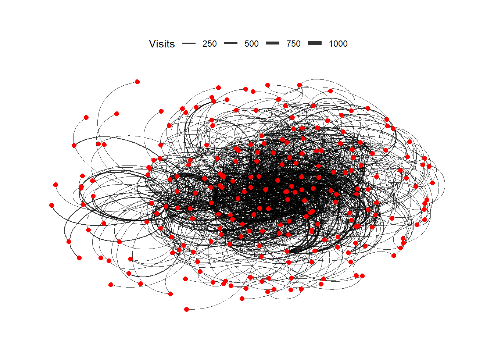
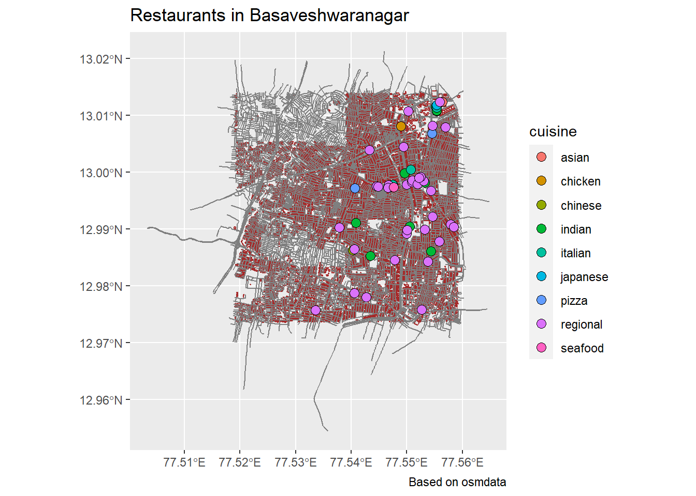

I am Aakarsh Shetty !! These are my favourite graphs in R!

<!--more-->
```{r setup, include=FALSE}
knitr::opts_chunk$set(echo = FALSE)
```


This is a Geom Point graph which has colored points to show visual differentiation among the dots and also points towards the trend that, ideally cut diamonds are always more expensive.
```{r eval= FALSE} 

ggplot(data = diamonds,
  aes(x = carat,
      y = price,
      color = cut)) +  
geom_point(size = 1.5)
```




In this network graph we can see how frequently flights arrive and depart from airports and we can also see them interconnect from one node to another. Here the nodes show all the airports in the USA. The line connecting a node to another, shows the flight travelling from an airport to other airports.

```{r eval = FALSE}

ggraph(AIRLINES, layout = "kk") +
  geom_edge_arc(aes(width = Weight ), alpha = 0.8) +
  scale_edge_width(range = c(0.2, 2)) +
  geom_node_point(size = 2, colour = "red") +
  labs(edge_width = "Visits") +
  theme_graph()+
  theme(legend.position = "top")
```



This is a map of Basaveshwaranagar, the area from where I belong. The dots show restaurants in my area, they are coded in different colors according to different cuisines. The brown color which you can see all over the map shows buildings and the dark grey colored lines are the streets.
```{r eval= FALSE}
restaurant$cuisine %>% unique()
```

```{r eval= FALSE}
restaurant <- restaurant %>% 
  drop_na(cuisine) %>% # Knock off nondescript restaurants
  
  # Some have more than one classification ;-()
  # Separated by semicolon or comma, so....
  separate(col = cuisine, into = c("cuisine", NA, NA), sep = ";") %>% 
  separate(col = cuisine, into = c("cuisine", NA, NA), sep = ",")
```

```{r eval= FALSE}
ggplot() +
  geom_sf(data = buildings, colour = "brown") +
  geom_sf(data = roads, colour = "grey50") +
  geom_sf(
    data = restaurant %>% drop_na(cuisine),
    aes(fill = cuisine),
    colour = "black",
    shape = 21,
    size = 3
  ) +
  theme(legend.position = "right") +
  labs(title = "Restaurants in Basaveshwaranagar",
       caption = "Based on osmdata")
```
