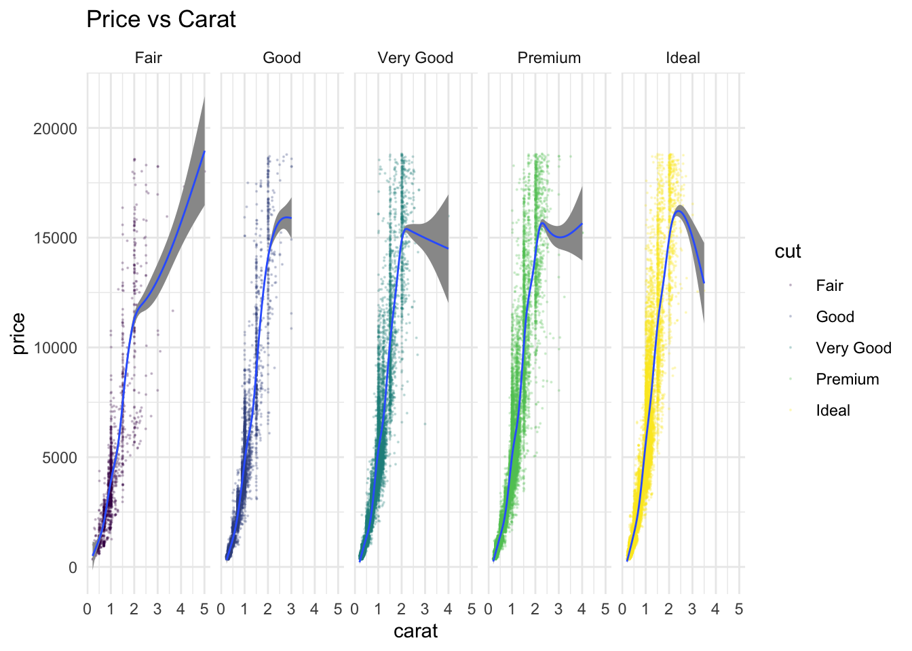
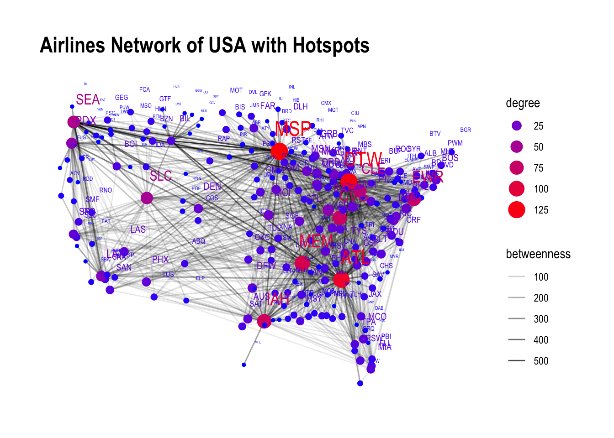
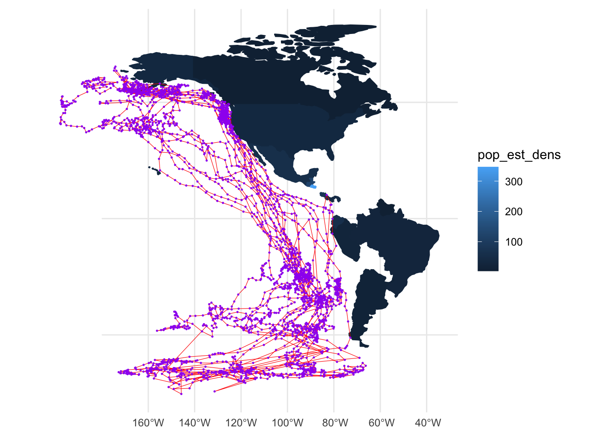

```{r setup, include=FALSE}
knitr::opts_chunk$set(echo = TRUE)
# Invoke all your packages here()
# library(blah blah)

library(ggplot2)
library(dplyr)
library(tidyverse)
library(knitr)

```


Hi! I am Adit Joshi from Pune. I am going to show the different "visualizations" that I made throughout this course

<!--more-->

## Introduction
I was in this class for **2 weeks**, 2 weeks of coding in R and visualizing data.  
I am going to show the different "visualizations" that I made throughout this course, analyzing data and making inferences from the same.

## Graph 1

```{r read-1}
my_data_1 <- diamonds
glimpse(my_data_1)
head(my_data_1) %>% kable()
tail(my_data_1) %>% kable()

```
  * **Price:** price in US dollars ($326–$18,823)
  * **Carat:** weight of the diamond (0.2–5.01)
  * **Cut:** quality of the cut (Fair, Good, Very Good, Premium, Ideal)
  * **Colour:** diamond colour, from D (best) to J (worst)
  * **Clarity:** a measurement of how clear the diamond is (I1 (worst), SI2, SI1, VS2, VS1, VVS2, VVS1, IF (best))
  * **x:** length in mm (0–10.74)
  * **y:** width in mm (0–58.9)
  * **z:** depth in mm (0–31.8)
  * **Depth:** total depth percentage = z / mean(x, y) = 2 * z / (x + y) (43–79)
  * **Table:** width of top of diamond relative to widest point (43–95)

There are 10 variables that talk about the properties of diamonds. There are 53940 observations or entries. We used the help function to see the description of each of the different variables. We also transferred the data set into a set of our own so that we could see the entire data in tabular form for reference.

### Price vs Carat

In this graph, we plotted the price up against carat of the diamonds to compare and determine the price of the diamonds.

```{r plot-1, eval=FALSE}
my_data_1 %>% 
  ggplot() + 
  
  geom_point(aes(x=carat, y=price, colour=cut),alpha = 0.2, size=0.1) + 
  geom_smooth(aes(x=carat, y=price),alpha = 5, size = 0.5) + 
  facet_grid(~cut) + 
  theme_minimal() + 
  labs(title = "Price vs Carat")

```



Up until 2-2.5 range carat the prices of all the cuts increases quite steeply and at almost the same rate. After this there is a change in the individual trends of each of the cuts of the diamonds. The lower cut diamonds suffer a lesser drop (in fact the fair still goes up but with a smaller angle) while the higher cut diamonds suffer a steep decline. Another observation is that at higher carats there is no higher cut diamonds, just fair cut diamonds at a very high price. So the most expensive diamonds are of higher carat but a fair cut.
An interpretation is that it is probably difficult to produce higher carat diamonds with higher or ideal cut.  
These interpretations are based off of approximations of a lot of observations so they may or may not apply for a lot of cases.

## Graph 2

```{r read-2}
my_data_2 <- read_delim(file = "data/AIRLINES-NODES.csv", delim = ";")
glimpse(my_data_2)
head(my_data_2) %>% kable()
tail(my_data_2) %>% kable()

```

This data set is a record of all the airports in USA along with their respective locations. It also contains a column recording the number of visits at that airport.

### Network of USA Airlines

```{r plot-2, eval=FALSE}
air_centrality %>% 
  ggraph(layout = mylayout) +
  geom_edge_link0(aes(alpha = betweenness)) + 
  geom_node_point(aes(size = degree, color = degree)) +
  scale_edge_alpha(range = c(0.06, 0.8)) + 
  scale_color_gradient(guide = "legend",
                       low = "blue",
                       high = "red") +
  geom_node_text(aes(label = Code, size = degree, color = degree), nudge_x = 2, nudge_y = 2) +
  labs(title = "Airlines Network of USA with Hotspots")

```



This network shows the **major connected airports** in the United States of America. It shows the airports with the most connections. The big and red dots represent the airports with the most amount of connections. The opacity of the lines represent the betweenness of the connections.  
From this we can infer that the major airports are **Atlanta, Minneapolis, Detroit, Houston and Memphis**. While the least connected with least traffic is **Mc Allen, Miami and Albuquerque**.

## Graph 3

The following map represents the migration pattern of "Arctic Terns" across the globe. This data was gathered from "movebank.org" which contains a lot of data on the migration patterns of a lot of different birds and animals.

This map shows the western hemisphere of the world since that is where these birds migrate. The pattern of migration is clearly visible represented by purple dots and red lines.

```{r plot-3, eval=FALSE}
ggplot() +
  geom_sf(data = west_terns, aes(fill = pop_est_dens, color = pop_est_dens)) +
  geom_sf(data = terns_lines, color = "red", size = 0.2) +
  geom_sf(data = terns_points, color = "purple", size = 0.2) +
 
  theme_minimal()

```



The Arctic Terns migrate **along the entire globe.** They travel over the oceans and **migrate seasonally**. The reasons for migration could be weather, food or to find nesting areas.This cannot be determined from the above map as there is no such data represented in the map above. The blue colour gradients show the population density in each country.

## My Course Reflection

I was a little skeptical about coding at first since I am not very fond of it. But as I progressed through the course I learnt that it is hardly about the code or about the medium. The fact of the matter was that we were representing data, the tool you use is irrelevant. In fact I also realized that maybe R coding was one of the best and most efficient ways of representing said data. I am still glad that I was introduced to this multipurpose tool.  
This course revealed to me the importance of data and the gathering of it. It reveals patterns, gives information and understanding on various "variables" that we may not have been aware of. I started noticing different ways in which recorded data could have helped in different situations outside of college as well. I could see myself looking for patterns, ways in which I could visualize data that was around me.  
I also learnt about the dark side of data visualization, cleaning up data. This is one of the most important parts of the process. It is a painstaking process to tidy up the data. But it is even more difficult and frustrating to visualize untidy data, which is why cleaning up the data is so important.  
I believe that even in data visualization, design thinking principles are important and must be applied to efficiently visualize the data. The visualizations must be easy to read and understand without looking at the actual data itself. The colours and the general layout must be thought through thoroughly. These aesthetic decisions can completely change the look of the graph and give or take away its purpose.  

I throughly enjoyed this class through its ups and downs. Even when it seemed like "other classes are doing cool stuff bro". a(R)vind will be missed in Srishti.
  
  
  
  
less than 3.
