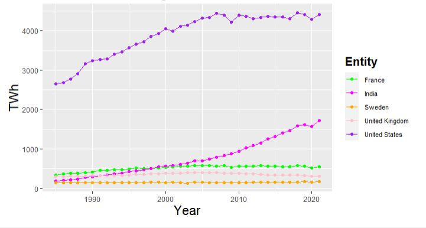
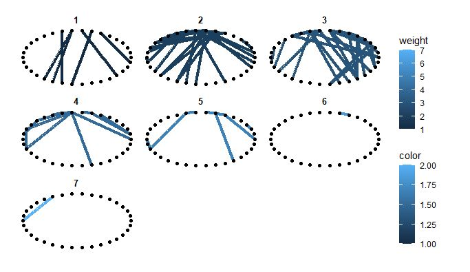
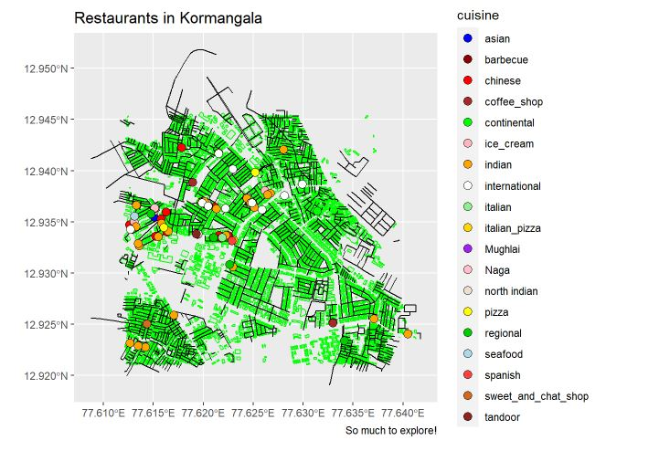

```{r setup, include=FALSE}
knitr::opts_chunk$set(echo = TRUE)
```

Hi! I am Adit Joshi from Pune. I am going to show the different "visualizations" that I made throughout this course

<!--more-->


## Introduction

Hii!! Welcome to my journey through **R** . I am Adit Maheshwari, I m doing DMA in Shrishti and a student of Arvind and his *cruel*(jk ) workshop classes. On this page today you will find different analytical graphs based on pre-made and hardworked on self made datasets. Hopefully you leave this site with some interesting info from these analytical research!

### Graph-1

##### The line and point graph here shows the gradual progress of electrical generation from the 1850 till October of 2021.This graph particularly shows the electricity production of United States, India, United Kingdoms, France and Sweden as these are one of the most electricity generating countries. The electricity on y-axis is measured in TWh (Terawatt per hour).

```{r read-1, eval=FALSE}
electric<-read.csv(file = "electricity-generation.csv")
electric

my_colors1 <- c("green", "magenta", "orange", "pink", "purple")
s1 <- electric_twh %>% group_by(Entity) %>% 
  filter(Entity=="Sweden" | Entity=="United Kingdom" | Entity=="United States" | Entity=="India" | Entity=="France") %>% 
  ggplot(data = .,aes(x = Year, y= TWh, colour=Entity ))+ scale_colour_manual(values = my_colors1) + labs(title = "Electricity Generation") +
  geom_point()+geom_line() 
s1 + theme(plot.background = element_rect(fill="white"), axis.title.y = element_text(size= rel(1.5), angle = 90), axis.title.x = element_text(size = rel(1.5)), legend.background = element_rect(fill = "white"), legend.text = element_text(size=8), legend.title = element_text(size=15, face = "bold"), plot.title = element_text(size = 40))
```



### Graph - 2

##### This is the well-known and much-used Zachary karate club network. The data was collected from the members of a university karate club by Wayne Zachary in 1977. Each node represents a member of the club, and each edge represents a tie between two members of the club. The network is undirected. An often-discussed problem using this dataset is to find the two groups of people into which the karate club split after an argument between two teachers. This graph shows how many members had the same preferences. this graph is separated into different smaller graphs depending on the preferences.

```{r read - 2, eval=FALSE}
data("karate",package= "igraphdata")
karate

ggraph(karate,layout = "linear", circular = TRUE) + 
  geom_edge_link(aes(color = weight), width = 1.5) + 
  geom_node_point(aes(fill = color)) +
  facet_edges(~ weight)
```




### Graph - 3

##### This is a static map graph of a place very near to me. The grpah shows the whole layout of Kormangala, Bangalore and where the amazing restaurants of Kormangala are. Each restaurant is special for some kind of cuisine, to show that, the points are dedicated a colour according to the cuisine as seen on the legend. **Fun Fact - Kormangala actually has 2000+ restaurants and cafe's.**

```{r read - 3, eval=FALSE}
bbox_1 <- osmdata::getbb("Koramangala, Bengaluru, Karnataka, India")
bbox_1

buildings <- st_read("./buildings.gpkg")

parks <- st_read("./parks.gpkg")

greenery <- st_read("./greenery.gpkg")

trees <- st_read("./trees.gpkg")

roads <- st_read("./roads.gpkg")

restaurants <- st_read("./restaurants.gpkg")

my_colors <- (c("blue", "darkred", "red", "brown", "green", "lightpink", "orange", "white", "lightgreen", "gold", "purple", "pink", "antiquewhite2", "yellow", "green3", "lightblue", "brown1", "chocolate", "brown4"))

  ggplot() +
  geom_sf(data = buildings, colour = "green") +
  geom_sf(data = roads, colour = "black") +
  geom_sf(
    data = restaurants %>% drop_na(cuisine),
    aes(fill = cuisine),
    colour = "black",
    shape = 21,
    size = 3
  ) + scale_fill_manual(values =  my_colors) +
  theme(legend.position = "right") +
  labs(title = "Restaurants in Kormangala",
       caption = "So much to explore!")
```




# REFLECTION

This course was about the coding language known as **R**. This was possible through a exptension named Rstudio. We learnt how to represent and analyse the given or self made data sets, to make it into a understandable graph.

 I learnt how to visualize data in such a way that i can depict it to others in a easy to read method. We learnt the difference between qualitative and quantitative variables and what situations each is more useful in.We learnt how to plot a bunch of different graphs in RStudio. To name a few grpahs we learnt, histogram, bar graph, line graph, point graph, box plot and area graph through ggplot, network graphs using geom_nodes and geom_edges, and maps through ggraph.

How it will help my practice as an aspiring artist and designer.... I have been asking this question to myself for the past few weeks and a few things i could thought of were  that it is helpful for making future website promoting or showcasing art. It can be useful in project works like making presentations and other coll things. But if its useful to me in the future or not, these were some fun and interesting couple of weeks.

***Arvind is a horrible teacher and simply does not get what we need. Boomers should be allowed to teach any more in Srishti.***


***----------------------------Jai Hind.------------------------------***


