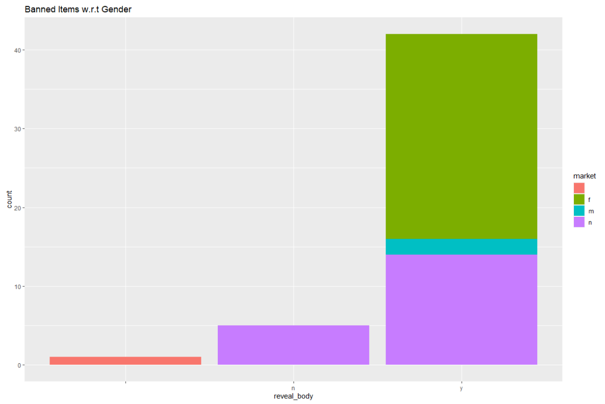
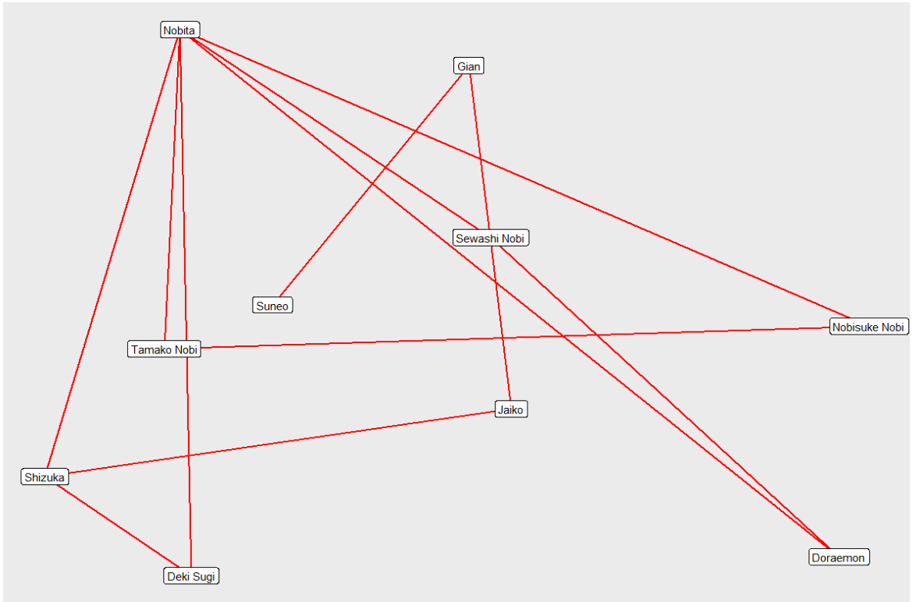
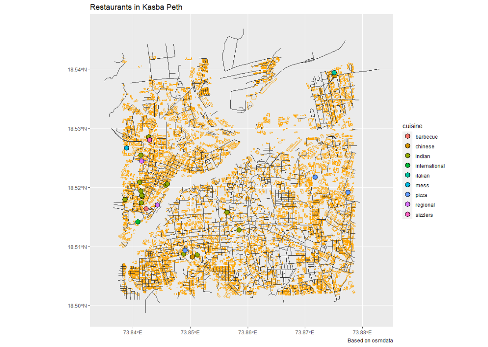

```{r setup, include=FALSE}
knitr::opts_chunk$set(echo = TRUE)
# Invoke all your packages here()
# library(blah blah)
library(tidyverse)

```


Hello, I'm Gayatri Jadhav from Pune. My major is CAC and this is my Data exploration journey through R.

<!--more-->

## Graph 1

Brief introduction of your chosen data set Describe the interesting columns and what they mean

```{r read-1, eval=FALSE}
my_data_1 <- read_csv(".data/clothes.csv")
glimpse(my_data_1)

```

This file contains manually-entered details about the most commonly prohibited clothing items and styles."Manually entered" being one of the reasons why I chose this data, because Data is expensive`r emoji::emoji("wink")`.

```{r plot-1, eval=FALSE}
ggplot(clothes_filtered) + geom_bar(aes(x = reveal_body, fill = market), position = "stack") + ggtitle("Banned Items w.r.t Gender")

```

The reason I went with a stacked bar chart is because there are two categorical variables that I wanted to highlight. The first variable, 'reveal body' is shown along the entire length of the bar, and the second variable, 'market' is represented as stacks within each categorical bar.This graph states a very interesting analysis. When I observe the graph, most banned clothing items are typically the ones that are made for or marketed to the female audience, and ofcourse most dress codes are only made for females. These dress code rules must be changed and females need to be given an adequate amount of freedom to present themselves in the society.

## Graph 2

This is the Doraemon Dataset. It is a manually entered Dataset.We watched the first episode of Doreamon Season1. We noted the number of interactions between each character to find out an interesting observation.

```{r read-2, eval=FALSE}
my_data_2 <- read_csv(".Data/doraemon.csv")
glimpse(my_data_2)

```


This graph shows the interactions of the different characters. Nobita has interacted with the most number of people(6 interactions) whereas Suneo has interacted with the least number of people(1 interaction).Everytime I run this chunk, the form keeps changing due to the 'fr' layout.

```{r plot-2, eval=FALSE}
ggraph(graph = doraemon, layout = "fr") + geom_edge_link0(width = 1, color = "red") + geom_node_point(shape = 19, size = 7, color = "green3") + geom_node_label(aes(label = `character name`))

```

## Graph 3

Mapping Restaurants- This Dataset has all the restaurants in Pune and what they offer, I have filtered out the restaurants that offer the various cuisines in Kasba Peth, Pune.

```{r read-3, eval=FALSE}
my_data_3 <- read_csv(.Data/maps.csv)
glimpse(my_data_3)
```


This graph is based ob OSM data. It shows the various Restaurants that have various cuisines. Each cuisine type has a different colour shown in the legend on the right. So next time you're in Pune, you know where to go to eat based on your cravings!! I also made this graph interactive by using tmap_mode("view") command.

```{r plot-3, eval=FALSE}
ggplot() +
  geom_sf(data = buildings, colour = "orange") +  
  geom_sf(data = roads, col = "gray20") + 
  geom_sf(data = restaurants %>% drop_na(cuisine), aes(fill = cuisine), colour = "black", shape = 21, size = 4) + theme(legend.position = "right") + labs(title = "Restaurants in Kasba Peth", caption = "Based on osmdata")

```
 
 
 
 
  ###    **THANKYOU** `r emoji::emoji("pray")`

## My Course Reflection

R  is an open-source programming language that is widely used as a statistical software and data analysis tool,  basically, it's a **sus** language for **sus** people. Throughout this workshop, I got to analyse different kinds of datasets and make interesting discoveries and observations in a matter of just two hectic but fun weeks. I learnt that data is expensive, complicated and quite often biased. The most fun part was collecting data manually for a network graph, to survey people the traditional way is a fascinating experience. 

I remember panicking on the 3rd day as I wasn't getting anything right, Arvind taught me that the only way to get better at this is through trial and error and to stick to it and continue to code. This was a nerve-wracking experience and loved and hated every bit of it! I feel extremely lucky to be a part of Arvind's final Workshop. This was an adventure, no kidding!

Jai Hind.
