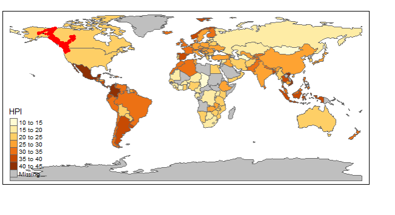
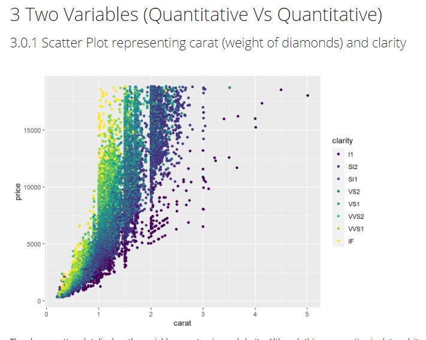
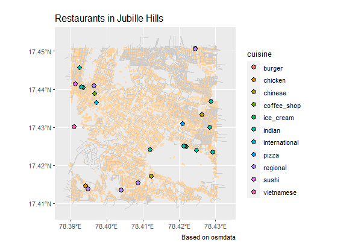

```{r setup, include=FALSE}
knitr::opts_chunk$set(echo = TRUE)
```

  The last few months at Srishti have really widen by horizon of dealing with new ways to express myself.To me one such experience is "R". Something that was very unexpected and surprisingly was fun. To me the fact that computer applications can be used to really express ourselves been very interesting. Something that stuck to me with this workshop was how Arvind went about to help us to come to conclusions about data visualization,
  
  Until last week, data visualization to me has always been about using convention step deviation methods etc,but now my perception has changes for the better.The idea of these 2 weeks was to visually represent data by using R as means of commutation. Each assignment had an agenda of dissecting and understanding R. We saw data present in R , unknown data sets, networking and maps.

  Now i can sort of say that R is something i see  myself working on. It has been a very surprising journey for me, i had dropped learning computers in grade 6 now now picking up such an application has been quite a challenge for me.I have come to stage where i might be even interested in picking coding as a means of designing. The live example of a current Srishti student who tapped into the side of data analysis through design was very fascinating to me.

   Though the projects i created were no where close but end of 2 weeks i am proud of what i have created, below are some projects:
   
   

### __World Map of all the Migrating Bald Eagles__

   
```{r_map of blad eagles,eval= FALSE}
tmap_mode ("plot")
tm_tiles ("Stamen.Watercolor")+
 tm_shape(World) +
   tm_polygons("HPI")+
  
  tm_shape(eagles_lines)+
   tm_lines(size = 1,
               col = "black") +
  
  tm_shape(eagles_points)+
    tm_dots(size = 0.1,
              col = "red")


```


### __Scatter Plot representing carat and clarity of diamonds__

```{r double_variable_graph_1.,eval=FALSE}
ggplot(diamonds) + geom_point(aes(x = carat, y = price, colour = clarity))

```
   
### __Mapping restaurants in Jubliee Hills, Hyderabad__


```{r}

ggplot() +
  geom_sf(data = buildings, colour = "burlywood1") +
  geom_sf(data = roads, colour = "gray80") +
  geom_sf(
    data = restaurants %>% drop_na(cuisine),
    aes(fill = cuisine),
    colour = "black",
    shape = 21,
    size = 3
  ) +
  theme(legend.position = "right") +
  labs(title = "Restaurants in Jubille Hills",
       caption = "Based on osmdata")
```
```


  
   
   
