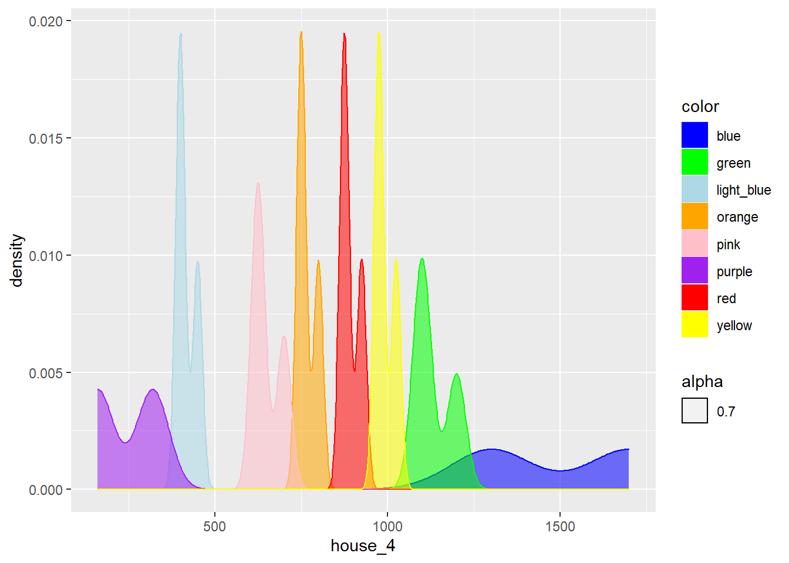
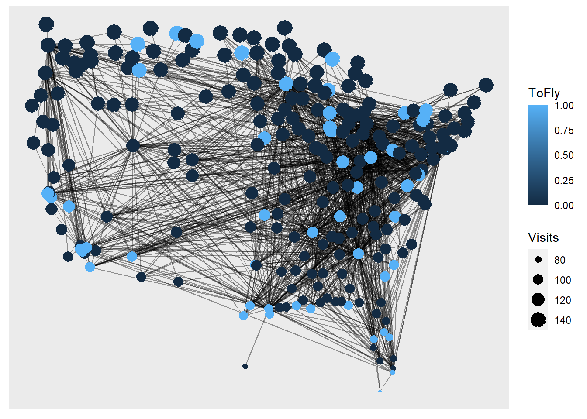
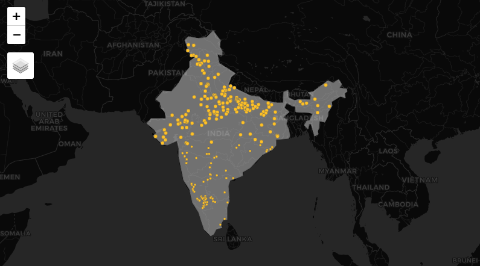

```{r setup, include=FALSE}
knitr::opts_chunk$set(echo = TRUE)
```


## **Portfolio:**

### **A1:** Monopoly Graph



This is a density graph  which shows the number of properties sorted by their color and house cost. Here I made my own color data and manually filled the colors for each property. I did this to make the visualization more comprehensive as for a game like monopoly, you can get the gist of the property information just by glancing at the graph's colors.

```{r eval=FALSE}
my_colors <- c("blue", "green", "lightblue", "orange", "pink", "purple", "red", "yellow")

ggplot(data = monopoly) +  
       aes(x = house_4, fill = color, color = color, alpha = 0.7) +
  geom_density() +
    scale_fill_manual(values = my_colors) + scale_color_manual(values = my_colors) 

```


### **A2:** Airline Network


Here, instead of plotting a normal graph with attributes of nodes and edges, I tried to lay out all the nodes with their corresponding latitude and longitude, which gave out an interesting result. (also the data for edge variables like latitude and longitude, being quantitative, were quite difficult or almost impossible to plot without the geometry of position). The outcome looks like a map of the US as all the airports are scattered across a specific boundary and there is dense air traffic around geographically important locations in the US. For the nodes, I have assigned the 'ToFly' variable to the color and the 'Visits' to the dot size.

```{r eval=FALSE}
airline_nodes <- read_delim("Data/AIRLINES-NODES.csv",delim = ";")
airline_edges <- read_delim("Data/AIRLINES-EDGES.csv",delim = ";")

airline <- tbl_graph(nodes = airline_nodes, 
                edges = airline_edges, 
                directed = FALSE)
airline

airline2 <- airline_nodes %>% select(latitude, longitude) %>% transmute(Latitude = latitude / 1000000, Longitude = longitude / 1000000)
           
airline2

my_layout <- cbind(x = airline2$Longitude, y = airline2$Latitude) %>% as.matrix()
g <- tbl_graph(nodes = airline_nodes, edges = airline_edges)
ggraph(g, layout = my_layout) + geom_edge_link0(alpha = 0.4) + geom_node_point(aes(color = ToFly, size = Visits)) + theme(legend.position = "right")
```

### **A3:** Indian Map with 'pur' villages


This is a map of India containing all the villages, towns and cities ending with 'pur', 'pura', 'puri', etc. Here I tried to show the night view of the map and all the villages with yellow colors referring to the dias burnt in these places during diwali and emitting the light.

```{r eval=FALSE}
data("World")
india <- World %>% filter(iso_a3 == "IND")

crs_india <- st_crs(india)

pur_sf <- st_as_sf(pur, 
         coords = c("LNG.", "LAT."),
           crs = crs_india) 

tm_basemap(leaflet::providers$CartoDB.DarkMatter)+ tm_shape(india) + tm_polygons( alpha= 0.5) + 
  tm_shape(pur_sf) + tm_symbols(size = 0.2, col = "goldenrod1")

tmap_mode("view")
```

## **Reflection:**

This week was the most Information packed course here at Srishti since I've been here. The course was very structured right from the start of the week and we had our end goals in mind but at the same time, we made some decisions Which modified the course a little according to the short amount of time we had. We were a diverse group of individuals, with the majority of us knowing nothing about coding or related topics. As a result, we began by using some simple games and experiments to help us visualize the data/information we would later create. I believe it would have been difficult to learn and comprehend a coding language without first envisioning it in a human-centered manner. We then started with basic about formatting and slowly started to code by running already written code to get the logic behind  it and not scratch our heads getting strangled into the errors of syntax. Then as we got a hang of it, some interesting assignments were thrown towards us, which were quite interesting as they contained information about the topics we liked which made us dig deep into it. If the topics for our assignment weren't as interesting as they were, many of us wouldn't have put such efforts for it. We did multiple things like graphs, networks, maps etc. Though, learning R was not easy, the connections with grammar and the metaphors made it quite layman easy for anyone to pick it up. No doubt we faced so many errors, but the feeling of solving them made us proud. Overall the course was very interesting to me and I would love to explore more about R and dig deep.
