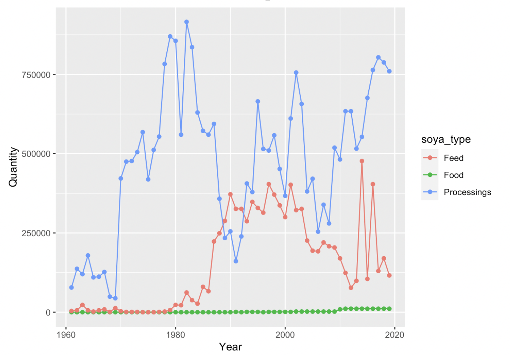
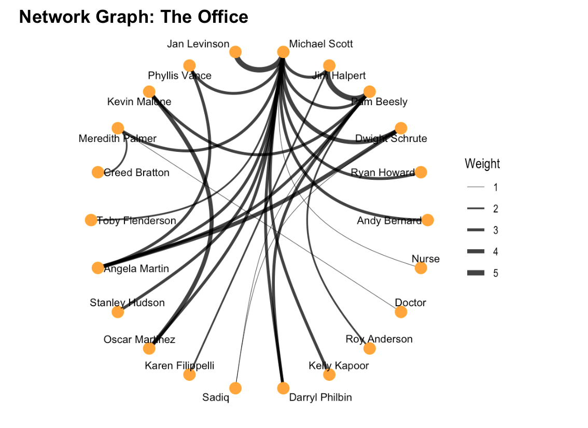
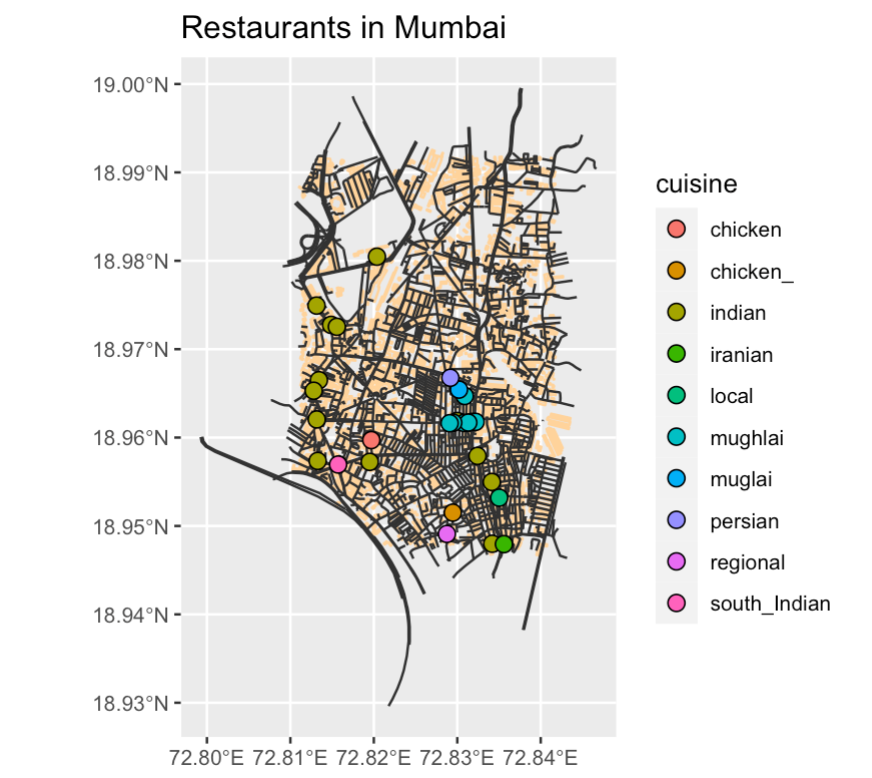

Hi! I am Mariya Vahanvaty. I am going to show the different "visualizations" that I made throughout this course

<!--more-->

```{r setup, include=FALSE}
knitr::opts_chunk$set(echo = TRUE)
library(rnaturalearth)
library(rnaturalearthdata)
library(tidyverse)
library(tmap)
library(osmplotr)
library(leaflet)
library(threejs)
library(sf)
library(knitr)

```

## Introduction

Hello, my name is Mariya Vahanvaty. I'm a first year and my major is digital media arts. I've never been exposed to coding until this workshop and I think it's an understatement to say it was challenging for me. Although, due to it being an unexplored area, it was very interesting and I learnt something new everyday during this workshop. 

The main aim of this workshop was to learn about data, how to read it, how to organize it, how to visualize it and all using code. The program we used to code is called R studio. Using R studio, we explored various data sets and learnt how to manipulate them in order to end up with graphical representations of the same.

## Graph 1

In this task, I explored the use of soya beans in countries around the world. This data set allowed me to explore the quantity of soybeans and the usage over the years. The three main usages highlighted were Food (human consumption), feed (animal consumption) and Processings (fuel, etc). This data set was derived from an olnine website which displayed the data sets for soya bean consumption all over the world.This data was then altered and filtered to cover only France and its soya bean consumption.


```{r read-1_, echo=TRUE, eval=FALSE}

soyabean <- read.csv(file = "data/soybeandata.csv", col.names = c("Country", "Code", "Year", "Food", "Feed", "Processings"), skip = 1)

```


In this graph, I will be plotting three different lines. Line 1 shows the human consumption of soya beans, line 2 shows the consumption of soya beans by animals and line 3 display soya beans sued for fuel and processing. In this graph, the x-axis displays the years which show us the change in consumption over time and the y-axis displays the quantity of soya beans in tonnes.  




```{r plot-1, echo=TRUE, eval=FALSE}
names(soyabean) # Step 1
head(soyabean) # Step 2
tail(soyabean) # Step 3
dim(soyabean) # Step 4

soyabean %>% pivot_longer(cols = c(Food, Feed, Processings), names_to = "soya_type", values_to = "Quantity") # Step 5

soyabean %>% pivot_longer(cols = c(Food, Feed, Processings), names_to = "soya_type", values_to = "Quantity") %>% filter(Country == "France") # Step 6

soyabean %>% pivot_longer(cols = c(Food, Feed, Processings), names_to = "soya_type", values_to = "Quantity") %>% filter(Country == "France") %>% ggplot(data = ., aes(x = Year, y = Quantity, colour = soya_type)) + geom_line() + geom_point() # Step 7

```


## Graph 2


In this task, we were told to watch a tv show of our choice and record the interactions between different characters during this episode. The tv show we chose was the american sitcom, 'The Office'. During this episode, we recorded nodes and edges data where we collected information about the character such as name, occupation, etc. And in the edges, we collected data about the interaction that took place, such as to and from, etc. 


```{r read-2, echo=TRUE, eval=FALSE}

office_nodes <- read_delim("data/Office Nodes.csv",delim = ",")
office_edges <- read_delim("data/Office Edges.csv", delim = ",")

office_edges
office_nodes 

glimpse(office_edges)
glimpse(office_nodes)

```


The graph we plotted displayed the nodes and edges of this data set. This graph is also known as a network graph as it displays the networks created amongst things/people or this case, the characters in the office. As it can be seen, characters are labelled with their names and edges link them together to represent their interactions that took place in that episode. These nodes have been further categorised by departments of the office. This is evident because of the colouring of the nodes as characters from different departments are seen interacting with each other. 





```{r plot-2, echo=TRUE, eval=FALSE}

office_graph <- tbl_graph (nodes = office_nodes, edges = office_edges, directed = FALSE)
office_graph #1

of_occupation %>% 
  ggraph(layout = "graphopt") + 
  geom_edge_link() + 
  geom_node_point(aes(color = occupation), 
                  size = 4) +
    geom_node_text(aes(label = name),
                   repel = TRUE, 
                   size = 4 
                   nudge_x = 3, nudge_y = 3) +
  scale_colour_brewer(palette = "Accent") #2

```


## Graph 3


During our A3, we learnt about mapping. We learnt how to create maps to represent our data. In this task, the data set we used was coordinates of our hometowns. We researched the coordinates using google maps and then read it into R which we then used to create our maps.


```{r read-3, echo=TRUE, eval=FALSE}
bbox_1 <- osmplotr::get_bbox(latlon = c(72.811431, 18.991465, 72.841547, 18.947786))
bbox_1

glimpse(bbox_1)
```


In this graph, we used to coordinates of our hometowns to recreate a map of the city. We then used this map to highlight restaurants, buildings, roads, trees, water bodies and other such features of a city on the map. After this step, we categorised the restaurants by assigning colours to multiple cuisines. This can be seen as the different coloured points showcase restaurants of different cuisines. The various cusines are shown in the key below. 





```{r plot-3, echo=TRUE, eval=FALSE}

bbox_1 #1

dat_buildings <-extract_osm_objects (key = "building", 
                                     bbox = bbox_1) #1

dat_roads <- extract_osm_objects (key = 'highway',
                                     bbox = bbox_1) #2

dat_parks <- extract_osm_objects (key = 'park', 
                                  bbox = bbox_1) #3

dat_greenery <- extract_osm_objects (key = 'landuse', 
                                  value = 'grass', 
                                  bbox = bbox_1) #4

dat_trees <- extract_osm_objects (key = 'natural', 
                                  value = 'tree', 
                                  bbox = bbox_1) #5

dat_amenity <- extract_osm_objects (key = 'amenity', 
                                  value = "restaurant",
                                  return_type = "point",
                                  bbox = bbox_1) #6
                                  
                                  st_write(dat_buildings, 
         dsn = "buildings.gpkg", 
         append = FALSE, 
         quiet = FALSE)

st_write(dat_parks, dsn = "parks.gpkg", append = FALSE, quiet = FALSE)
st_write(dat_greenery, dsn = "greenery.gpkg", append = FALSE,quiet = FALSE)
st_write(dat_trees, dsn = "trees.gpkg", append = FALSE,quiet = FALSE)
st_write(dat_roads, dsn = "roads.gpkg", append = FALSE, quiet = FALSE)
st_write(dat_amenity, dsn = "amenity.gpkg", append = FALSE, quiet = FALSE) #7

buildings <- st_read("./buildings.gpkg")
parks <- st_read("./parks.gpkg")
greenery <- st_read("./greenery.gpkg")
trees <- st_read("./trees.gpkg")
roads <- st_read("./roads.gpkg")
amenity <- st_read("./amenity.gpkg") #8

ggplot() +
  geom_sf(data = buildings, colour = "grey") +    
  geom_sf(data = roads, col = "gray20") +           
  geom_sf(data = parks, col = "darkseagreen1") +  
  geom_sf(data = greenery, col = "darkseagreen") +
  geom_sf(data = trees, col = "green") +
  geom_sf(data = amenity, col = "pink") #9
  
  tm_shape(buildings) +
  tm_fill(col = "mediumblue") +
  tm_shape(roads) +
  tm_lines(col = "gold") +
  tm_shape(greenery) +
  tm_polygons(col = "limegreen") +
  tm_shape(parks) +
  tm_polygons(col = "limegreen") +
  tm_shape(trees) +
  tm_dots(col = "green") +
  tm_shape(amenity) +
  tm_dots(col = "red") #10
  
restaurants <- st_read("./amenity.gpkg") #11

amenity %>% nrow() #12

names(amenity) #13

amenity$cuisine %>% unique() #14

amenity <- amenity %>% 
  drop_na(cuisine) %>%

  separate(col = cuisine, into = c("cuisine", NA, NA), sep = ";") %>% 
  separate(col = cuisine, into = c("cuisine", NA, NA), sep = ",")

amenity$cuisine #15

ggplot() +
  geom_sf(data = buildings, colour = "burlywood1") +
  geom_sf(data = roads, colour = "gray20") +
  geom_sf(
    data = amenity %>% drop_na(cuisine),
    aes(fill = cuisine),
    colour = "black",
    shape = 21,
    size = 3
  ) +
  theme(legend.position = "right") +
  labs(title = "Restaurants in Mumbai") #16
  
```


## My Course Reflection


This course was definitely a challenging one for as I've never been exposed to coding before. Learning and understanding how to write code from scratch seemed very daunting at the start, although as the course progressed, it seemed more logical than deemed. It was easier to understand how language and code collide to create your final outcome. This course also taught me about being patient as getting your code right could take up to a few hours but if you pay attention to it, it is definitely fixable.

I think this course allowed me to understand how vast coding is and the many possible things that could be simply done using code. Along with learning code, this course introduced me to R studio and the world of data and graphs. 

My main challenge faced during this course was not being able to comprehend new "code" very quickly. It definitely took me longer in comparison to the rest of my class. Although, this was mainly a set back on my time and not necessarily on my learning as I was able to understand the code after sometime of breaking my head over it. 

I think this course taught me many things and although I was not the most optimistic at the start, I've grown to appreciate everything I've learnt about code. It is still a daunting subject for me but it will not limit me from attempting to learn more. 
